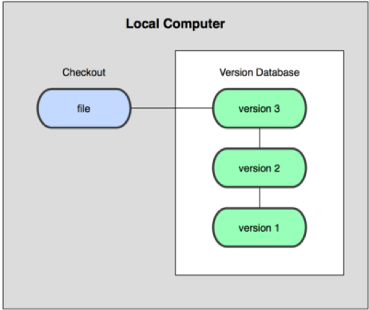
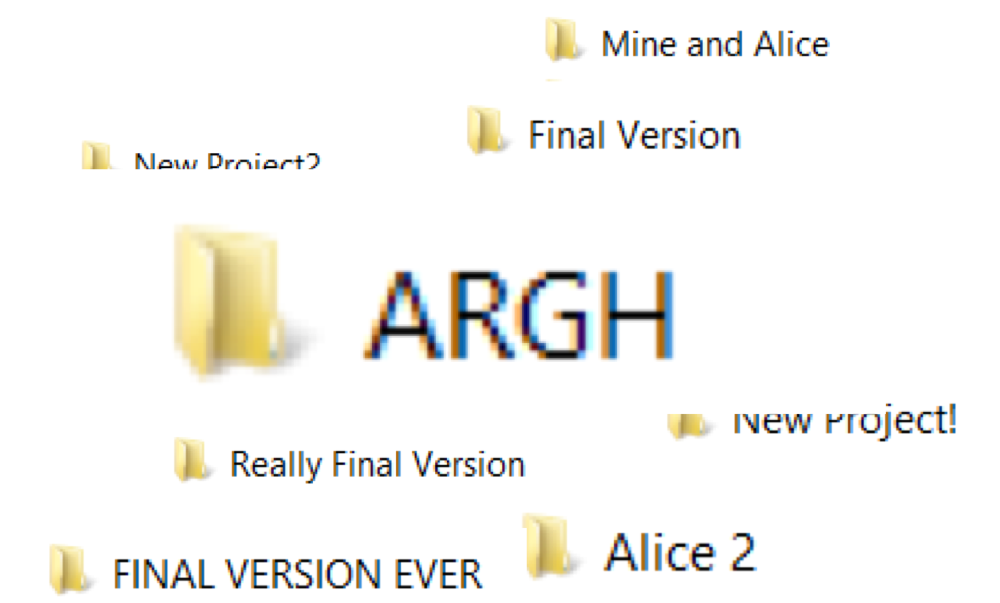
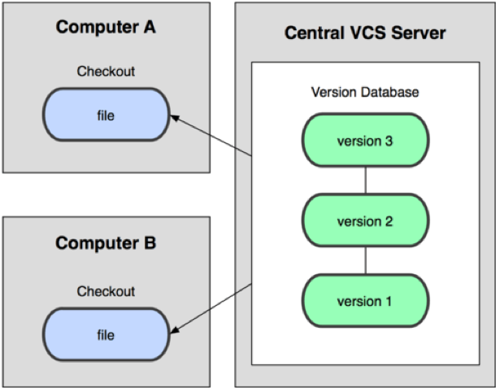
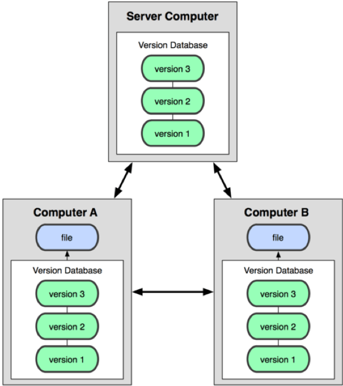

# What is Version Control - Concepts

Version control is a system that records changes to files

A VCS allows you to manage file history allowing you to:

- Rolling back to previous states of a file if something goes wrong
- Maintain change logs allowing you compare versioning issues

---

## Why use version control

Keep track of code and changes

- One copy of the code everyone has access to
- No more mailing around code and confusion trying to integrate it
- Automated version management

Allows for multiple people to edit a single project at the same time

- Push changes to the central repository
- Everyone can pull changes from others
- Merge together changes in files where there are conflicts

Branch code to work on specific parts

- Version 2.3 doesn’t need to die because someone else wants to look at version 3

---

## Benefits of Version Control

Don’t mail around versions of your code!

- Automated version management

Allows for multiple people to edit a single project at the same time

Push your changes to a central repository

- ONLY push changes when they work

Pull changes from other people from the central repository

Merge changes together where you’re both using the same files

- Source control works best with plain text

Branch code to work on specific parts

- Version 2.3 doesn’t need to die because someone else wants to look at version 3

---

## Types of Version Control Systems

### Centralised Version Control Systems (CVCS)

CVCS systems allow multiple developers to collaborate on other systems

- e.g. CVS, Subversion and Perforce

Single server that contains all version controlled files

- Clients that check out files from this source

### Distributed Version Control Systems

DVCS do not just check out the most local snapshot of a file

- They mirror the repository
- so each checkout is like a backup of the repository

Git and Mercurial are examples of  

