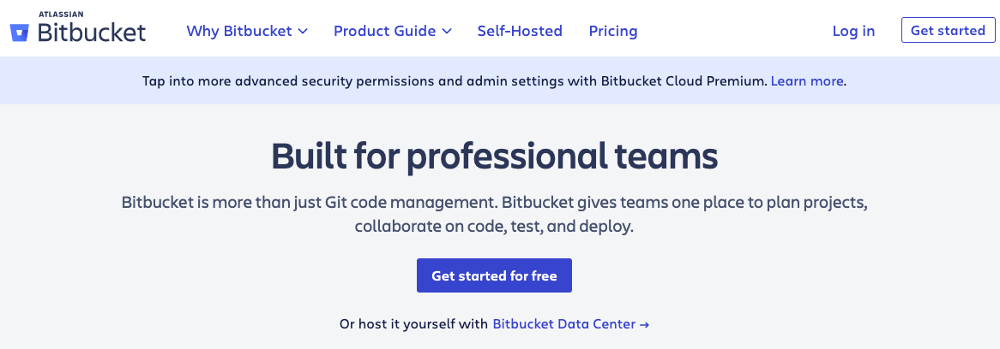
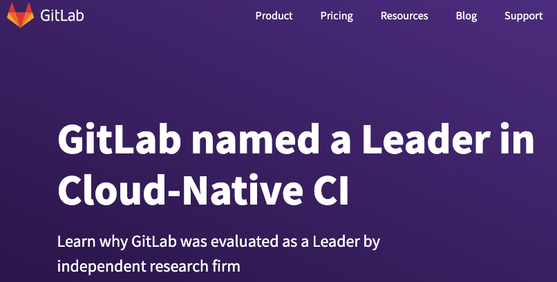

# GIT as a DVCS

GIT’s origins are in Linux Development and is open source

Its goals were to create a DVCS system that was:

- Fast
- Simple
- Strong support for non-linear development
- Fully distributed
- Able to handle large projects like the Linux kernel efficiently

---

## Choosing a DVCS for Git

### GitHub

### BitBucket

### GitLabs

When using git server or a hosting site, you might follow these steps:

1. Create a repository on a hosting site, or own server
2. **Check out** the repository to your own machine using `git remote add`
3. **Add** some code
4. **Commit** your changes to the local repository
5. **Push** changes to the remote repository using `git push`

---

## Alternatives

**Git** is not the only source control method out there

- Popular due to the open source nature
- Simple to use
- Context switching between branches easier
- Local staging area for commits
- GUI tools available such as Sourcetree
- Built in tools in eclipse

## Subversion (SVN)

- Similar idea to Git
- Add new files, commit to the repository
- Pull files from the repository
- Tortoise / Rabbit SVN give built in windows context menu options

## CVS, Mercurial, Bazaar, Fossil, Veracity… many others

---

## The SSH Protocol - used when communicating with the remote server

The SSH File Transfer Protocol is a network protocol

- Provides file access, file transfer, and file management functionalities
- It is a UNIX-based command interface and protocol
- Used for securely getting access to a remote computer

It is widely used to control Web and other kinds of servers remotely

- SSH is actually a suite of three utilities - slogin, ssh, and scp
- SSH commands are encrypted and secure
  - Authenticated using a digital certificate
  - Passwords are protected by being encrypted
  - SSH uses RSA public key cryptography
    - For both connection and authentication
