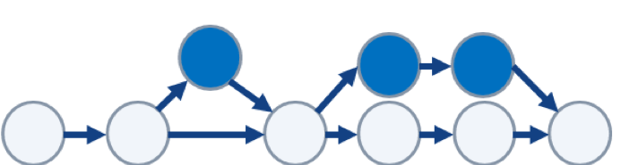

# Git Basics

## Initialising repositories

Creates a new subdirectory and creates a git repository skeleton

`git init`

## Initialising a repository with existing files

`git add *.pp`

`git add README.md`

`git commit -m "Initial commit"`

## Cloning an existing repository

- Git can use a number of protocols including http and SSH

`git clone git://github.com/resource`

---

## Recording Changes to a Repository

Each file in a  git directory can be tracked or untracked

- Tracked files are files that were in the last snapshot
  - They can be unmodified, modified or staged
- Untracked files are everything else
  - Not in your last snapshot or staging area


The main tool you use to determine which files are in which state is the git status command. If you run this command directly after a clone, you should see something like this:

`git status`

On branch master nothing to commit, working directory clean

Note: The graphic shown above is taken from the following article:

https://git-scm.com/book/en/v2/Git-Basics-Recording-Changes-to-the-Repository

## Staging new or "modified" files

`git add <filename>`

You can have GIT ignore files or folders through the ```.gitignore``` file

- Add them to the file
- This can be automated

---

## Working with Remote Repositories

Git projects are often held on remote repositories

- These hold versions of a project or dependencies on the web/network

To see configured remote repositories run the `git remote` command

- If you have cloned a repository you should see the origin
- To add a repository:

`git remote add [shortname][url]`

*shortname* becomes an alias for access to the repository

### Pushing to a repo

When you have your project at a point you want to share you have to **push** it upstream

`git push origin master`

You can also specify `-v`, which shows you the *URL* that Git has stored for the short name to be expanded to.

If you want to *rename* a reference, in newer versions of Git you can run `git remote rename` to change a remote’s shortname.

`git remote rename pb dave`

`git remote origin dave`

It’s worth mentioning that this changes your remote branch names, too. What used to be referenced at pb/master is now at paul/master.

If you want to remove a reference for some reason — you’ve moved the server or are no longer using a particular mirror, or perhaps a contributor isn’t contributing any more — you can use git remote rm:

`git remote rm dave`

`git remote origin`

### Pulling a repo

To pull all the changes made to the repository then we can use the `pull` command

`git pull`

It is good practice to pull the repository before pushing changes

- You get an up to date copy of the repo to push to
- You can see any conflicts before they are pushed
- You can `stash` your changes before pulling the remote branch

---

## Git Branching



Branching allows you to diverge from the main line of development

- Without doing accidental damage to the main line

Git branches are very lightweight compared to other VCS

- Git encourages a workflow that allows you to branch and merge

Branches build on core Git features

- When you commit you have a snapshot of current content
- Plus zero or more pointers to the current commits
- Based on this repository or parents

### Create new branch

`git checkout -b newBranchName`

Commit any changes to your code

`git commit -am "updated some file(s)"`

Merge branch back into main line

`git checkout master`

`git merge newBranchName`

Branching allows you to diverge from the main line of development without doing accidental damage to the main line.

Branches build on core Git features:

- When you commit you have a snapshot of current content.
- Plus zero or more pointers to the current commits.

Rather than use the `checkout –b` command shown above, you could use the following two commands:

`git branch newBranchName`

`git checkout newBranchName`
