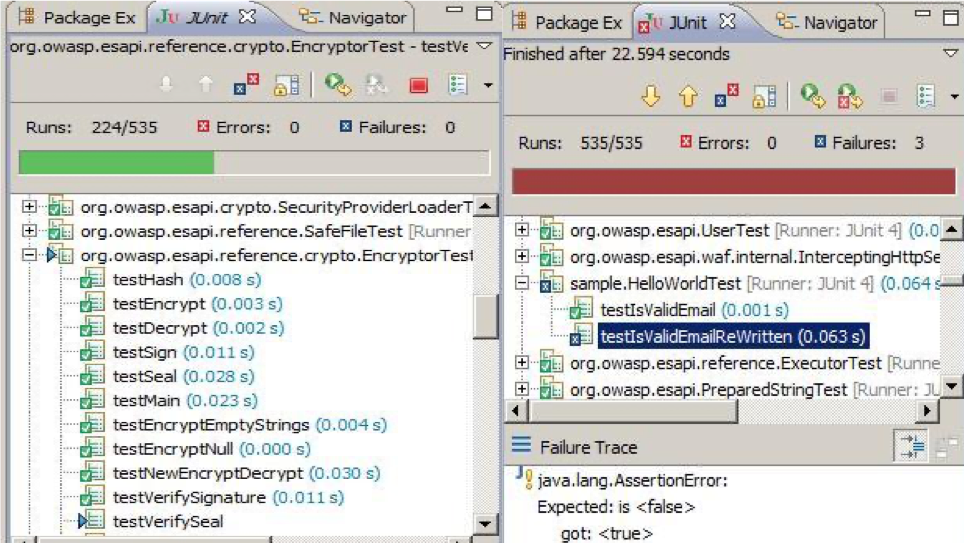
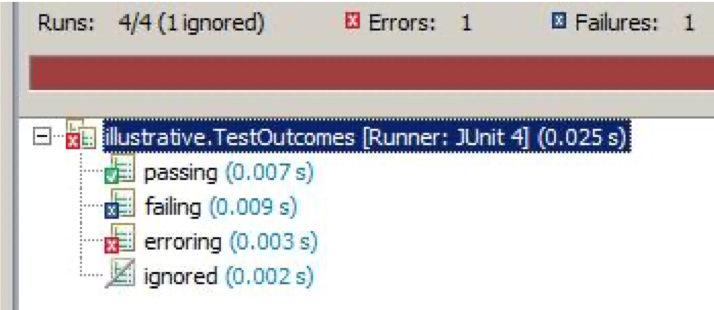

# Unit Testing Concepts

Core practice of XP

Can be adopted within other methodologies

*"Test-first programming is the least controversial and most widely adopted part of Extreme Programming (XP). By now the majority of professional Java™ programmers have probably caught the testing bug"* – **Elliotte Rusty Harold**

Test written before implementation

* Tools and techniques make TDD very rigorous process

AKA Test Driven Design

* Tests drive design of API

> *It is inconceivable that in today’s world any serious developer would develop an application without using a modern IDE with powerful refactoring capabilities, and develop their code in a largely test-driven manner.  The risks of not driving development through tests are too great.*  
> *When you’ve done TDD, you will be familiar with this experience: “I’ll just make this little change, I know it’s not going to have any consequences”… and then you re-run the tests, only to find that some tests are now red.  “Oh yes, of course… that change led to this consequence, which led to that now being wrong.”*  
>*If you hadn’t got the suite of tests covering your code base, that little bug would have insinuated itself into your application, only to come to light some months later, requiring someone to spend a lot of time tracking it down, with who knows how many other repercussions for other bits of the code.*
>*So, when you become ‘test infected’, when you have some new bit of functionality to implement, you don’t just dive in and start coding away.  You sit back and ask yourself: “So, how am I going to specify my next step in a test?”  And sometimes you may find yourself not being ‘productive’ in a conventional sense, thinking about your tests, discussing them with your colleagues, reorganising your tests, breaking large test classes up, extracting common setup to superclasses etc.  And then suddenly you may be able to write a whole bunch of new tests, and then surprisingly quickly implement the code which they specify.*

A unit can be:

* A method
* A database query, stored proc or transaction
* A dynamic web page

A unit test “tests one behaviour that is expected from an object.  It is also automated, self-validating, consistent/repeatable, independent, readable, easy to maintain and fast.”

---

## Unit Testing vs Component Testing vs Integration Testing

### Unit Testing

* Ensures all of the features within the Unit (class) are correct
* Dependent/Interfacing units are typically replaced by stubs, simulators or trusted components
* Tools that allow component mocking/simulation are often used

### Component Testing

* Similar to Unit testing but with a higher level of integration between units
* Units within component are tested as together real objects
* Dependent components can be mocked

### Integration Testing

* Involves the testing of two or more integrated components

---

## Some benefits of Unit Tests

As they test our code, shows us if our code really works

Saves a lot of time later down the line

* Helps prevent code later down the line not function how it should

Deployment is a lot easier

* We can use continuous integration (CI) to run our tests, pull down latest changes, push code to a remote repository

Detects defects early on – software bugs found early

Improves the quality of our code

Simplifies the debugging process

Localise the source of the bug more easily

---

## What are Unit Tests

A software testing method written in code where individual sections of code are tested.

We refer to a unit as the smallest testable part of the software under test.

Allows us to test bits of code in isolation.

Written before the code to be tested (known as TDD).

They are automated.

Tiny pieces of code that developers write, execute and maintain.

---

## The xUnit Framework

Common design: setup, test, assertion; suites of tests
Original: SUnit for Smalltalk (Kent Beck)
JUnit and TestNG for Java, NUnit for .Net, Test::Unit for Perl, DbUNit – extension of JUnit for databases, FlexUnit for Flex, etc

Unit Testing is also known as Component or Module Testing.  The concept originated in the 1970s, and the initial concept of what constitutes a “unit” was probably quite open-ended. It is a form of "White Box" testing – in other words, where the test has complete knowledge of the internals of the component being tested.  This contrasts with "Black Box" testing, in which only the interface of the component is being tested.

*Robert Martin (Clean Code, Ch. 9)* captures the modern conception of unit tests in the acronym FIRST:
Fast: they need to be fast so that developers will run them very frequently
Independent: one test must not be dependent on, or be affected by, any other test
Repeatable: they must be repeatable in every environment: development, QA, production
Self-Validating: they should either pass or fail automatically, not require any manual intervention or manual inspection of output logs
Timely: they should be written in a timely fashion (just before the application code – i.e. TDD)

For a list of xUnit implementations, see
[http://en.wikipedia.org/wiki/List_of_unit_testing_frameworks]

See the appendix [Java Unit Testing - JUnit Concepts](Appendix_1_JavaUnitTestingJUnitConcepts.md) for information on how JUnit works.

---

## Coding Tests by intention

Tests should be coded consistently with a well defined clear intent

Four phases are standard:

* Setup / Arrange
  * Setup the initial state for the test
  
* Exercise / Act
  * Perform the action under test

* Verify / Assert
  * Determine and verify the outcome

* Cleanup
  * Clean-up the state created

Each phase should be:

* Clearly Expressed
* Well documented

Expected Outcomes should be clearly expressed

---

## Test – Code – Refactor

### Kent Beck's summary of TDD

1. Write new code only if you first have a failing automated test
2. Eliminate duplication

### Red – Green – Refactor

The famous green bar is indeed a progress bar. The image on the right shows the final outcome of running this series of tests: there are 3 failures.

---

## Four statuses of a test

1. **Passing:** ultimately all our tests must pass

2. **Failing:** in TDD always start with a test which fails

3. **Erroring:** test neither passes nor fails

   * Something has gone wrong, a run-time error has occurred; e.g. necessary library jar has not been provided
  
4. **Ignored:** `@Test` `@Ignore`

---

## Manual Testing v Automated Testing

### Manual Testing

* Difficult to repeat tests in a consistent manner
* Can’t guarantee that in regression testing same values are re-entered
* In speed tests, it’s difficult for an operator to match a computer
* Can only be executed by certain people

Write a test harness for the Class Under Test

* Test harness sets up the code to be tested, acts upon it and reports the results

### Drawbacks

Manual inspection to see if code performed correctly

* error prone
* not scalable

Does not aggregate (x out y tests passed)
Does not indicate how much of the code was exercised
Does not integrate with other tools – build process, CI

`main()` does not tell you what the scenario is
Not extensible

### Automated Testing

* Can be executed by anyone
* Perfect for regression testing
* Series of contiguous testing can be done, where the results of one test rely on another
* The build test cycle is increased
