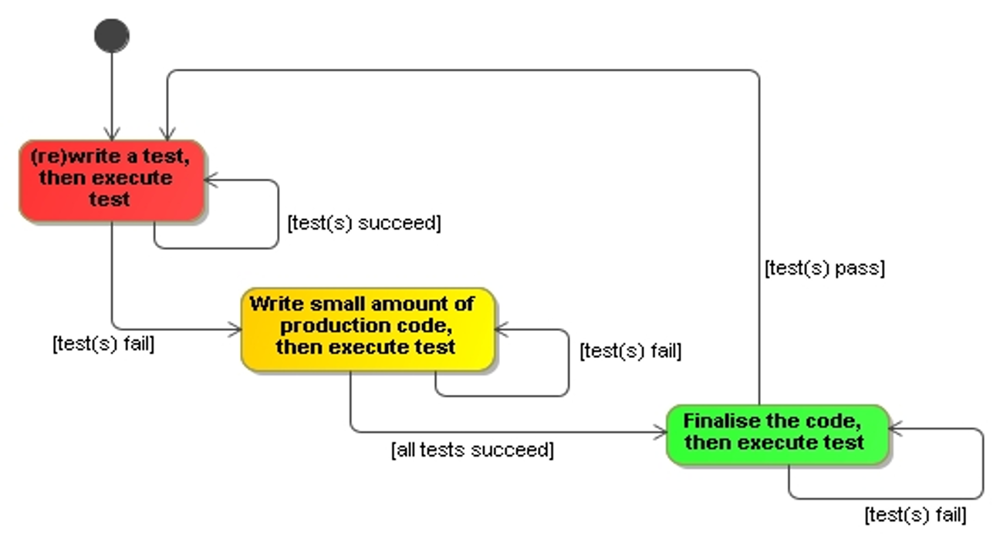
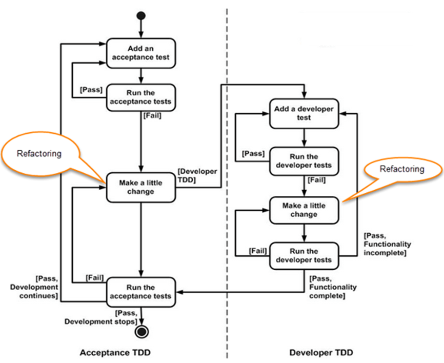
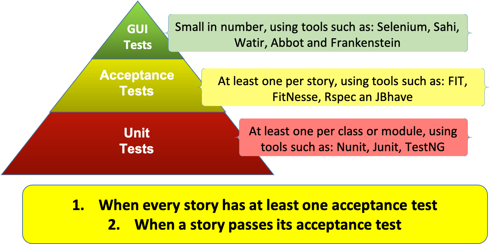
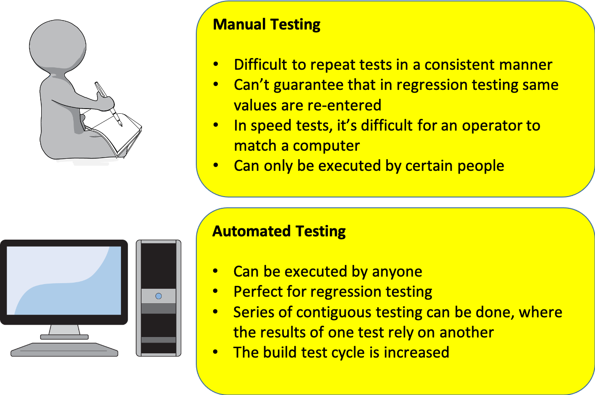
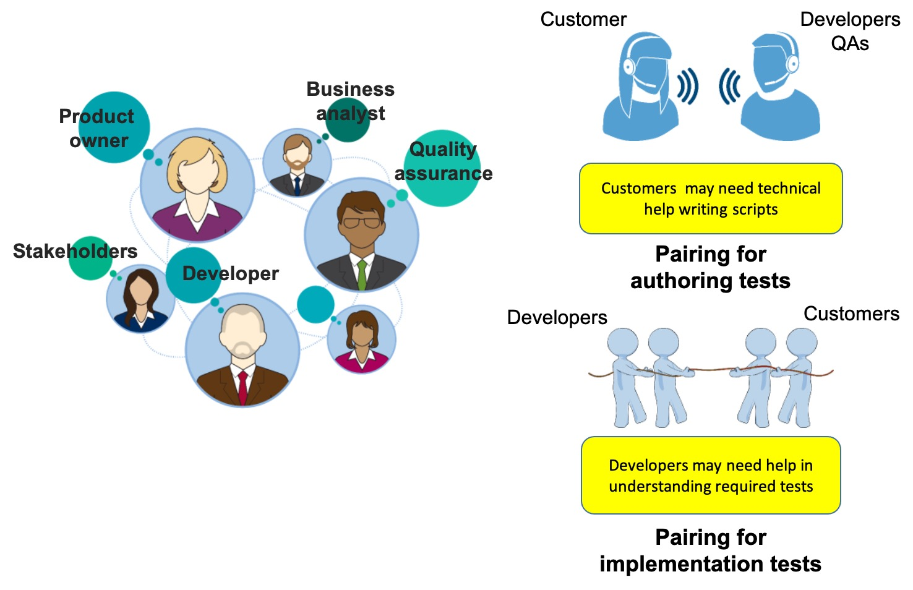
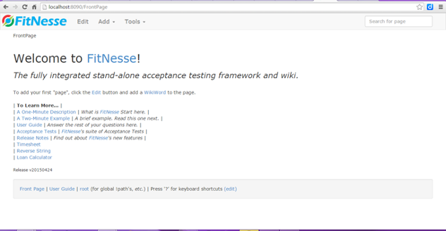

# Acceptance Test Driven Development Concepts

## Acceptance Criteria

Acceptance criteria defines the set of rules used to evaluate a feature of a product or service

- What does acceptable look like?
- What isn't acceptable

Discovering Acceptance Criteria involves:

- A conversation
- Different Perspectives

Typically Involves:

- Product Owners/Stakeholders/Analysts
- Testers
- Developers

Why is that?

---

## Acceptance Tests

Are Expressed as:

- Coded fixtures
- BDD Scenarios

Defining Done:

- Each Test/Scenario forms the set of rules defining DONE
- Done can be defined at different levels of granularity/modularity

Living Documentation:

- The union of all test/scenarios that express the acceptance criteria

---

## Using Examples

- We all use use examples to explain complicated concepts
- Examples illustrate complexity gradually
- Examples help Domain Expert explain the complexity of their domain
- Examples help developers and testers extract acceptance criteria and acceptance tests

---

## Red - Green - Refactor Workflow



---

## Acceptance Criteria and Testing

An acceptance criteria is **NOT** acceptance test

An acceptance criteria:

- Is a set of conditions provided by the customer
- Can be expressed as:
  - Given `<some precondition>`
  - When `<actor performs some action>`
  - Then `<some observable result>`

**Acceptance tests** *=* **acceptance criteria** *+* **scenarios with instance values (data)**

Agile should NOT be an excuse for NOT doing Business analysis or system designs. We still need to ask, “Are we building the right product?” and “Are we building the product right?”

---

## ATDD Workflow



Ref: [https://www.guru99.com/test-driven-development.html]

---

## When is DONE done?

Mike Cohn groups testing as follows



---

## Automated or Manual Testing



---

## Acceptance Test Authors



---

## What makes a good test

Tests should reflect the intention not the implementation

- So the test values shouldn’t be trying to look at the internal values within the software
- So, never write tests by looking at the code
- Write test from user stories and acceptance criteria
- Developers should help write tests that look at edge conditions

Write tests to **prevent** defects *not to* find them!

---

## Zero Quality Control

### Toyota’s approach to achieving product quality

Quality should be built into products and, does not come from controlling and sorting out defects at the end

Examples ZQC through poka-yoke design:

- Ensuring cables that be connected together have a male and female type connector
- Fire alarms that cannot be installed unless a battery is fitted
- A lift won’t work if its overcrowded
- Manufacturing lines detecting errors in smaller components down stream so as to avoid larger defects in larger components upstream

---

## Acceptance Criteria should be SMART

Use the following pattern: **describe**, **demonstrate** and **develop**

Make the test plan SMART

| **S**pecific                  | No room for ambiguity                                         |
| **M**easureable               | The outcome can be quantified                                 |
| **A**chievable                | Given the current environment (technology, funds skills, etc) |
| **R**ealistic or **R**elevant | Is releated to the problem domain                             |
| **T**ime Bound                | When will the outcome be evident?                             |

---

## Example: Test Plans

Write a test plan, in plain text, for the business rules of logging into an ATM

Constraints are:

- Embedded application (proprietary platform with limited resources)
- Users credentials are stored in part on their card and on a server somewhere in world
- Success is indicated by a screen showing available options

## Poor examples of test statements

- User can insert their card and PIN details
- You can add account holders to the system
- You can add cards to the system
- The entered PIN is checked against the details on the card

## Possible test plan

- Add card types to the system (“Link”, “Visa”, “MasterCard”, “AMEX”)
- Request a card and a PIN, returned values (“Link”, “01-05-06”, “11220034”, “9987”)
- Login using card and different PIN (“Link”, “01-05-06”, “11220034”, “9986”)
- Check login fails
- Login using card and different PIN (“Link”, “01-05-06”, “11220034”, “9987”)
- Check login succeeds

## Not so good test plan

- Add card types to the system (`“Link”, “Visa”, “MasterCard”, “AMEX”`)
- Create an account (`“01-05-06”, “11220034”, “Selvyn”, “Wright”`)
- Check if account exits (`“01-05-06”, “11220034”, “Selvyn”, “Wright”`)
- Request a card and a PIN, returned values (`“Link”, “01-05-06”, “11220034”, “9987”`)
- Login using card and different PIN (`“Link”, “01-05-06”, “11220034”, “9986”`)
- Check login fails
- Login using card and different PIN (`“Link”, “01-05-06”, “11220034”, “9987”`)
- Check login succeeds

**SCOPE CREEP** and **NOT SMART**
Remember the exercise was about logging into an ATM *not testing if accounts exist or can be created*

## Focussed Testing

The previous section demonstrates what happens when SMART is not applied.

Nothing makes a developer look more stupid than when a bug that they thought they removed continually reappears.

### Simple rule

Discover a bug, write a test to confirm it!

---

## Recap on the rules

**Acceptance tests** *=* **acceptance criteria** *+* **scenarios with instance values (data)**

Done means:

- When every story has at least one acceptance test
- When a story passes its acceptance test

## ATDD Tools - FitNesse

**FitNesse** is about more than unit testing.  If unit testing is what you were looking for, then don’t use **FitNesse**, use something like JUnit or NUnit.

**FitNesse** sits squarely in the acceptance criteria space.  An acceptance criteria is a set of conditions that must be met.  These conditions are normally expressed in such a way to indicate boundary limits.  

A story is completed when all its acceptance tests have passed and, a story is comprised of a number of acceptance criteria.

---

## Stories

### What is a story

A statement of intent that brings value to the customer

### Structure of a story

As `<role>` I want `<goal>` so that `<benefit>`

As part of the business analysis role, stories should be researched so as to ascertain the business constraints, inputs and expected results

There is a lot of debate as to whether stories can be compared to use cases.  There is also much confusion by those giving their opinions as to what a use case is.  The UML specification defines a use case as a sequence of message between an actor and system under investigation.  Each use case must be supported by one or more scenarios.  Each scenario can be likened to a scenario within an acceptance criteria.  Each use case should also have a summary indicating its intent.  This should describe in brief a piece of functionality that brings some value to the business.

A story is simply a statement of intent from a customer indicating something that brings value to the business.  Every story needs further investigation and there should be a process of drilling into the intent until the stories intent is fully understood.  Stories are a great way of catching a clients attention and an ideal tool that they can use to specify their wants.

---

## Example: Writing Stories

Write a story for the bank to accept new customers, give them an account and issue them with bank card against that account.

After writing the story, define the constraints, expected inputs and results indicating success.

## Possible Solution: Writing Stories

As a **bank** I want **customers to open new accounts with us**, so that we **increase our market share**

### Constraints

- Background checks done and clear
- Must have a job and home telephone number

### Inputs

- Name, home address, work address, amount being used to open the account

### Observable results

- The customer can view their account details in a number of ways
- The balance on their account should be the amount they deposited when opening the account
- A bank card and their PIN for the card will be sent out to them in the post

## Example: Construct the Acceptance Criteria

Put together an acceptance criteria for the story you previously created – remember an acceptance criteria is a set of conditions that must be met.

### Some caveats

- An account holder cannot deposit more than £20,000 per day
- All sales employees must be accredited
- Card and PIN should never be sent out together

## Possible Solution: Construct the Acceptance Criteria

**Given** the presence of a reasonable set of customer prerequisites such as:

- ID checks (must show 3)
- credit checks
- applicant is 16 years or greater 
- completion of an new account application form with an initial deposit amount of greater than £0.00 (no more than £20,000.00 may be deposited within a single day)

**When** a member of the sales team (must be an accredited sales employee) reviews and submits the application along with the deposit

**Then** a new customer and account should be created showing the amount deposited into the account and, a new account card should be created and sent out to the customer:

- The PIN for the card should be sent out separately
- The card’s status is inactive until the customer rings in to activate it

---

## Scenarios

Scenarios are a mechanism to flush out the real issues behind a story.  By instantiating an acceptance criteria we can slowly begin to see how a story should be realised.  We can determine whether a story is fully met and built in a robust and efficient manner.

- Scenarios represent instantiated stories
  - Take the acceptance criteria and create real data values to demonstrate how it should be realised

Here are some simple tables to show how the previous acceptance criteria can be verified

| Name       | DOB          | Employment | Three IDs | IDs copied | Opening Deposit | Application No. | ?Application Status                             | ?Account Number |
| ---------- | ------------ | ---------- | --------- | ---------- | --------------- | --------------- | ----------------------------------------------- | --------------- |
| `<string>` | age > 16 yrs | Y/N        | Y/N       | Y/N        | > £0            | `<7 digits>`    | Verifying (v)/Being Queried (q)/Completed (c) |                 |

| Employee Number | Accredited | Application Number | Amount Deposited |
| --------------- | ---------- | ------------------ | ---------------- |
| `<string>`      | Y/N        | `<7 digits>`       | > £0             |

| ?Account Number | ?Balance |
| --------------- | -------- |
| `<7 digits>`    | > £0     |

Fields with a **?** signify that they are *expected results* columns

## Scenario Data

Tables populated with some instance data:

| Name          | DOB        | Employment | Three IDs | IDs copied | Opening Deposit | Application No. | ?Application Status | ?Account Number |
| ------------- | ---------- | ---------- | --------- | ---------- | --------------- | --------------- | ------------------- | --------------- |
| Selvyn Wright | 08/05/1965 | Y          | Y         | Y          | £20.00          | `2003939`       | V                   | `NIL`           |
| Claire Rogoff | 29/08/1978 | Y          | Y         | Y          | £30.00          | `2003940`       | C                   | `"00650101`     |
| Simon Ible    | 13/08/1972 | Y          | N         | Y          | £30.00          | `2003986`       | Q                   | `NIL`           |

| Employee Number | Accredited | Application Number | Amount Deposited |
| --------------- | ---------- | ------------------ | ---------------- |
| Amina Sar       | Y          | `2003939`          | £20.00           |
| Amina Sar       | Y          | `2003940`          | £30.00           |
| Mikal Yanech    | N          | `2003986`          | £30.00           |

| ?Account Number | ?Balance |
| --------------- | -------- |
| `NIL`           | `NIL`    |
| `"00650101`     | £30.00   |
| `NIL`           | `NIL`    |

Fields with a **?** signify that they are *expected results* columns.

Scenario data can be created directly in **FitNesse** or more easily using *Excel*.  When using *Excel*, you must copy the contents of the cells for the table into the Wiki editor.  There is no import feature in **FitNesse**.

## Source of scenario data

How did we arrive at the scenario data?

- Dissecting the acceptance criteria reveals a number of parameters
  - Number of IDs
  - Amount deposited would have to be greater than £0.00
  - The IDs would have to copied
  - The age of the applicant must be 16 years or greater

How do we know what data to look for when building a table that can be useful with **FitNesse**.  

If you were to speak to an experienced database modeller or OO modeller and ask them:

>“How do you know what makes a good class or table”?  

You might get the following answer back:

>“Look for the nouns; they represent the things of interest.  Look for adjectives; they represent information that’s pertinent to certain nouns.  And look for the verbs; they represent the relationships between the nouns”.  

The same principle can be applied when looking for data.  Look at the nouns and adjectives.  Ask yourself:

>“Which of these can vary, and if they can what are the boundaries”?

---

## FitNesse - An Automated Acceptance Testing Tool

A web application with its own server written in Java

- Allows collaboration and testing
- Built in wiki with editor for customisation

Contained in:

- `fitnesse.jar`

Requires:

- Java Runtime Environment
- JRE 6+

Execute using:

`java  –jar fitnesse.jar  –p <port>`



---

## Creating your own Wiki Area

### Wiki

A wiki allows any authorized user to make changes to any edit-enabled page, or to create new pages, simply by using their Web browser

### FitNesse Wiki

Accessed through the **FitNesse** front page:

- Select `Edit`
- Enter a *Camel Case Expression* with no space between each word
  - (there must be at least two upper case characters in your expression)
- Select `Save`
- On the front page a *question mark* appears, select it and a new page will be created

Valid expressions for Wiki areas: **SomePage**, **WikiTestForStudents**

Invalid expressions for Wiki areas: **financeTests**, **Financetests**, **Finance-tests**

There are some basic commands in the Wiki.  To make a piece of text **bold**, enclose the text in 3 single quotes, to give it *italics* format, enclose it with 2 single quotes and, to centre it, proceed it with `!c`.

## Page Properties

Each page has the following actions:

| Action         | Description                                                                                                                               |
| -------------- | ----------------------------------------------------------------------------------------------------------------------------------------- |
| **Edit**       | Causes the **Edit** button to be displayed                                                                                                |
| **Search**     | Causes the **Search** button to be displayed or hidden                                                                                    |
| **Test**       | Causes the **Test** button to be displayed and tells the wiki that test runs can be executed                                              |
| **Suite**      | Causes the **Suite** button to be displayed and sets the pages up as test suites                                                          |
| **Versions**   | Causes the **Versions** button to be displayed.  When selected a version page is displayed allowing users to see older versions of a page |
| **Properties** | Causes the **Properties** button to be displayed. When selected the properties page is displayed                                          |

## Headers and Footers

Headers and Footers can be created in a Wiki area by creating a child page of the Wiki area front page
From the Wiki area select, `Add child`, from the top of the page:

- For a header: enter `PageHeader`
- For a footer: enter `PageFooter`

To access your header or footer pages, append `.PageHeader` or `.PageFooter`

## Refactoring Pages

Pages may be by selecting the Refactor option:

- **Deleted** (when deleted, references will have `[?]`against them)
- **Renamed** (all references will be renamed)
- **Moved** (all references will be updated)

## Wiki mark-up language

For full reference see the [FitNesse Wiki Markup Language Reference](http://fitnesse.org/FitNesse.UserGuide.FitNesseWiki.MarkupLanguageReference#:~:text=The%20FitNesse%20markup%20language%20is,other%20things%20on%20wiki%20pages.&text=Setting%20a%20word%20or%20phrase%20in%20italics.)

- Literal text
- Lists
- Cross reference to other pages
- External links


### Literal Text

Preventing text from being interpreted:

- Will render the phrase WikiWord with no interpretation - 

```txt
!-WikiWord-!`
```

Rendering the text without interpretation but in bold:

- Will render the phrase **WikiWord** with no interpretation, but in **bold**

```txt
!-'''WikiWord'''-!
```

Rendering the text without interpretation but in italics

- Will render the phrase *WikiWord* with no interpretation, but in *italics*

```txt
!-''WikiWord''-!
```

### Lists

Creating bullet lists:

- Simply prefix the line to be bulleted with a space and asterisk

```txt
  * item 1
  * item 2
  * item 3
```

Creating numbered lists:

- Simply prefix the line to be bulleted with a space and asterisk

```txt
  1 item 1
  2 item 2
  3 item 3
```

### Cross reference to other pages

Adding cross references to other pages
Use the mark-up before the link:

```txt
  !see .FollowThisLink
```

### Creating external links

Creating hyperlinks to external web pages
Simply type the URL using the full syntax

```txt
  Correct: http://www.google.co.uk

  Incorrect: www.google.co.uk
```

