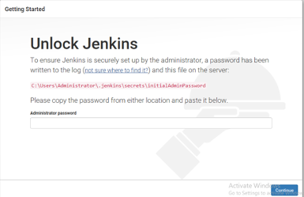
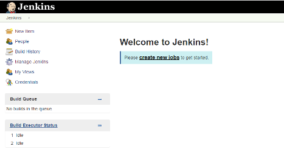
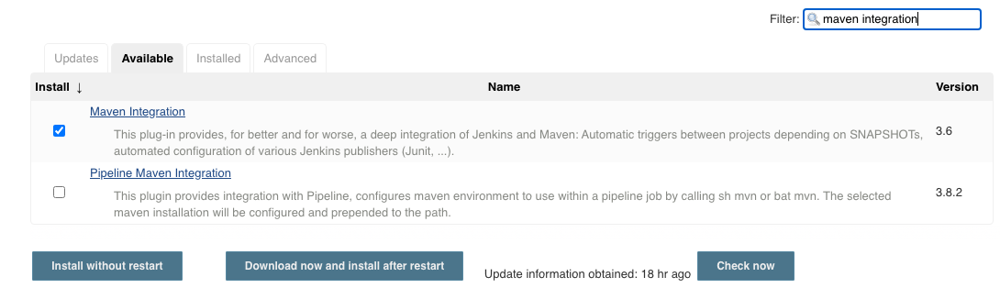
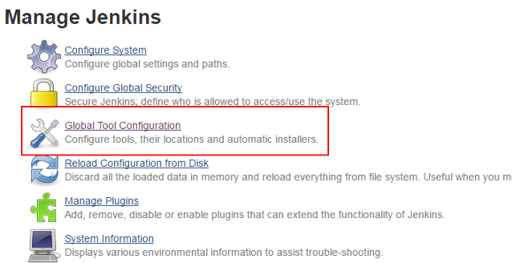
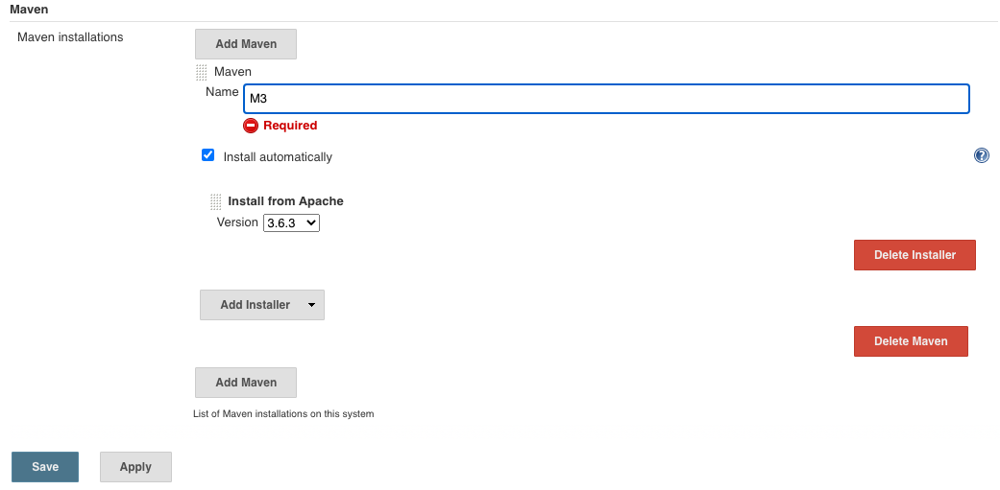
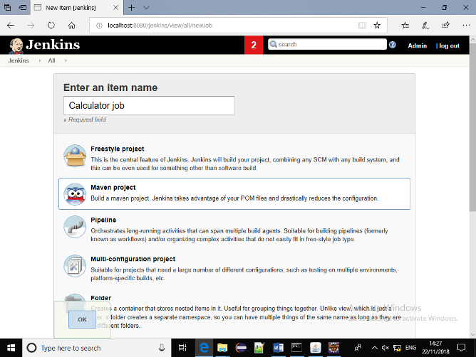

# Continuous Integration with Jenkins Concrete Practice

Please note that there are no language specific instructions for this activity.  The Learning Objectives being covered require you to demonstrate you are able to work with a Continuous Integration tool.

The project supplied is written in Java, but Jenkins can be set up as a Continuous Integration pipeline for any buildable software.

## Objectives

- To get Jenkins up and running on your system using Tomcat Server
- To explore the options Jenkins gives us for connecting to other services
- To explore the Jenkins dashboard

## Tooling Downloads

### 1. Download the latest version of Tomcat 9

Find the version for your system from [here](https://tomcat.apache.org/download-90.cgi) and download it.

Copy the download to your *Jenkins Concrete Practice* folder and extract it.

### 2. Download Jenkins Generic Java Package (.war)

Find the Long-term Support (LTS) version of the Generic Java Package from [here](https://www.jenkins.io/download/) and download it.

Copy the download to your *Jenkins Concrete Practice* folder.

## Setting up the Tomcat Server

1. Open a terminal or Command Prompt
2. Navigate to the **/bin** folder in the extracted *apache* folder
3. For Windows type the command `startup.bat`
4. For MacOS:
   1. Change the ownership of the apache folder using the command `sudo chown -R <your_username> /<apache_folder_name>`
   2. Change the permissions in the **bin** folder using the command `sudo chmod +x /<apache_folder_name>/bin/*.sh`
   3. With the terminal pointing to the **bin** folder type the command `startup.sh`
5. Some logging should be done in the console.
6. Navigate to [http://localhost:8080](http://localhost:8080) in your browser to check to see that the server is running

## Installing Jenkins

1. Copy the `Jenkins.war` file into the **\<apache_folder_name\>/webapps** folder
   - A folder called Jenkins should be automatically generated
2. Navigate to [http://localhost:8080/jenkins](http://localhost:8080/jenkins)
   - You should see the Jenkins login page

## Initially Setting Up Jenkins

Jenkins (now) requires you to provide the admin password when first accessing the server. Follow the instructions on the screen to retrieve it.

1. Obtain the initial admin password and copy it into the input in the window and click `Continue`
   - For Windows, use the `type` command followed by the appropriate path (as shown on screen) for your system
   - For MacOS, locate the file through Finder and open it with 'Text Editor'
2. When the next screen shows, you will be prompted to decide which plugins to install initially
   1. Click `Select plugins to install`
   2. Do not remove any of the defaults
   3. Add the following by checking their box:
      - JUnit Plugin - allows JUnit tests to be run
      - BitBucket Plugin - allows integration with a BitBucket repository
      - Matrix Project Plugin - a multi-project configuration tool
      - Windows Slave Plugin - allows you to setup agents on Windows machines over Windows Management Instrumentation (WMI) - not required on MacOS
3. Click `Install` and wait for the process to complete
4. When the installation completes, create a user called `root` with a memorable password, click `Save and Finish`
5. Leave the default URL and click `Save and Finish` again
6. Click `Start using Jenkins`

If Jenkins looks like it is frozen when you click save and finish, refresh the page and continue as admin. The password will be the one you retrieved earlier from the file, but this can be changed via the dashboard later.

You should now be presented with the dashboard. If it looks like the installer has crashed, then refresh the page. If this keeps happening, click `Continue as admin` rather than add a new admin user.

## Installing Build Plugins

1. Click `Manage Jenkins` from the menu on the left of the screen
2. Find `Manage Plugins` from the list in the middle of the screen and click on it

3. Click on the `Available` tab ad then search for `Maven Integration`

4. Click `Download now and install after restart`
5. Tick the box `Restart Jenkins when installation is complete and no jobs are running`
6. Click `enable auto refresh` which can be found under the 'log out' button at the top right of the screen
7. When the log in screen is shown, use your `root` username and password to log in again

## Enabling Maven

1. Click `Manage Jenkins` from the menu on the left of the screen
2. Find `Global Tool Configuration` from the list in the middle of the screen and click on i

3. Scroll down until you find the `Maven` section and click `Add Maven`
4. In the `Name` input box type `M3` and click `Save`

5. You will be returned to the `Manage Jenkins` screen - it is now configured to build Maven jobs!

## Creating a Job

### Overview

In this part of the activity, you will get Jenkins to monitor a pre-built project and build it and rebuild it on changes.  This will be done via local files, but it can be configured to monitor Git repositories and rebuild when there are new commits to them.

### Initialise the Calculator as a Git repo

For this part of the activity you will use the supplied **Calculator** project.

1. On you command line, navigate to the folder that contains the **Calculator** project
2. Initialise it as a new Git repo using `git init`
3. Add all of the files using `git add .`
4. Commit the files using `git commit -m "Initial commit"`

### Set up a Job

1. Reopen your browser window and get to the Jenkins dashboard [http://localhost:8080/jenkins](http://localhost:8080/jenkins), logging in if necessary
2. On the menu on the left, select `New Item`
3. In the `Enter an item name` input box type `Calculator Job`
4. Click on `Maven Project` so that a highlight box surrounds it
5. Click `OK`

6. On the next screen, scroll down to the `Source Code Management` section
7. Select the `Git` radio button and enter the path to the your **Calculator** project
8. Click the `Save` button

### Build the Job

1. Click `Build Now` on the menu on the left of the screen - you will notice a progress bar appears in the `Build History` section
2. Once the **Job** is complete, the progress bar will be replaced by a number link - this is the *Build Number*
3. Click the link to view the Build results

You will observe that all of the tests have passed and that the build was successful.

### Configure Jenkins' Build Triggers

1. In the **Calculator Project** window, select `Configure` from the left-hand menu
2. Click on the `Build Triggers` tab
3. Check the `Poll SCM` (Source Control Management) box
4. Enter `* * * * *` into the `Schedule` input box (Note the spaces between each *)
   - **Schedule** value uses the *chrontab* format - `* * * * *` tells **Jenkins** to poll the Git repo every minute
     - Using `H * * * *` would change the schedule to every hour - for some examples see [Chrontab Guru](https://crontab.guru/examples.html)
5. Click the `Save` button

Jenkins will retest and rebuild the project every time a commit is made to this repo.

### Making Commits

If you are used to Java, open the project in an IDE, make some changes, commit them and then skip to the next section.  

- We suggest making **at least 1 test fail** to have a visible effect on the build

If not, follow these instructions:

1. Open the file **CalculatorTest.java** from the project path `/src/test/java/com/agile/calculator`
2. Change the value of `expected` on **line 17** to `42`
3. Save the file
4. Add and commit this file to the repo

### Monitoring the Build

You should notice that within a minute (our scheduled poll time), a new build should initiate and complete. (Do not be tempted to click `Build Now` as changes in the repo may not be collected).

The change(s) to the repo will be picked up and the project will be built, running the tests.  This build will appear as `UNSTABLE` and if you investigate, you should be able to find out the reason why.

In our case, we followed the instructions above and clicking on the build shows that indeed the subtractTest failed.

Clicking on the link reveals the console output and at the top you can see that we got a result of `2` instead of the expected `42`.

### If you have time - further exploration

Revert the test to its passing state and verify that the build is successful again.

Try modifying the Calculator.java file - perhaps add a comment and/or change a return of one of the methods so the test will fail.

Let **Jenkins** initiate a build and verify the results are as you expected.

## Round Up

You have seen that **Jenkins** can monitor a **Git** repository and, of course, you can hook it into remote repositories - using WebHooks.  It can also be configured to run *linting* tools and package and deploy your code.

This sort of tool is an essential part of the Continuous Integration (and Delivery and Deployment) pipeline.