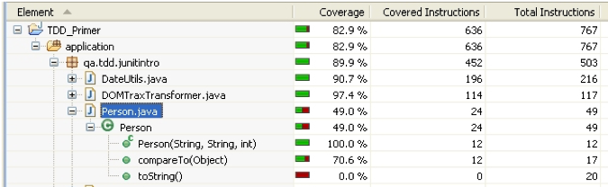

# Code Coverage - Appendix 1 - Emma and Eclemma for Java

## Overview

  

## Line-by-line

- Green: fully covered
- Yellow: partially covered
- Red: not covered at all

Eclemma provides a free Eclipse plug-in version of Emma (update site: [http://update.eclemma.org]).  Launching one or more JUnit tests in coverage mode will re-run all those tests, and when finished bring up the Coverage view, which provides a very convenient summary of percentage coverage at the project, package, class and method levels.  

Opening a source file after a coverage run will show it with Eclemma's line-by-line coverage analysis.  (Once you start to edit the file, the colouring disappears.  Alternatively click the 'Remove Active Session' button in the Coverage view, to clear coverage colouring from all files affected.)  

In the example illustrated, a non-parameterised version of Comparable has been implemented – i.e. we don’t have the type-safe version compareTo(Person p), but compareTo(Object o).  From the green decoration of the next two lines we can infer that there is no coverage of the exception-raising case of comparing with something which is not a Person. By contrast, if there is no test to exercise the line of code in the toString() method, it is picked out in red.  

(Tip: if you follow the best practice advice of separating application and testing source folders, for a single package, you need to do a bit of extra work to avoid the testing classes being spuriously annotated by Eclemma.  This is because by default both sets of source folders will have their .class files generated into a single output folder.  To enable Eclemma to distinguish between the two, in the project's Java Build Path, specify different output folders for the two source folders.)
