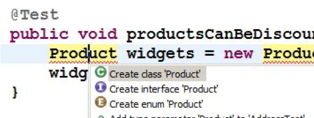

# Simple JUnit example

## Class Under Test (CUT) - Version 1

```java
public class Example {
    public boolean canJoin(int age) {
        return age > 21;
    }
}
```

## JUnit - Version 1

```java
class ExampleTests {
    private Example cut;

    @BeforeEach
    void setUp() throws Exception {
        cut = new Example();
    }

    @Test
    void testCanJoin() {
        int age = 15;
        boolean expected = false;
        boolean result = cut.canJoin(age);
        assertFalse(result);
    }
}
```

---

## Another JUnit example

### Class Under Test (CUT) - Version 2

```java
public int sumArrayOfIntergers(int[] array) {
    int sum = 0;
    for(int i = 0; i < array.length; i++) {
        sum += array[i];
    }
    return sum
}
```

## JUnit - Version 2

```java
@Test
void testSumArrayOfIntegers() {
    int[] numbers = {10, 20, 30, 40};
    int expected = 100;
    int actual = cut.sumArrayOfIntegers(numbers);
    assertEquals(expected, actual);
}
```

---

## JUnit: Principal Java xUnit framework

Developed by:

* Kent Beck (Extreme Programming – XP)
* Eric Gamma (Design Patterns)

3 Versions:

* JUnit 3 (main package: junit.framework)
* JUnit 4 (main package: org.junit)
* JUnit 5 (result of JUnit Lambda, focuses on Java 8 and above)

How to run:

* Command line – central to build scripts
* `java org.junit.runner.JUnitCore my.pkg.AllTests`
* IDE: Eclipse, IntelliJ, NetBeans
* Standalone GUI: AWT, Swing – JUnit 3 only

---

## junit.framework.Assert

TestCase inherits from Assert

### Methods are overloaded – e.g

`assertEquals(boolean expected, boolean actual)`

`assertEquals(Object expected, Object actual)`

`assertEquals(String message, Object expected, Object actual)`

* Use String version: on failure, exception thrown with message
* Remember order: expected then actual

### Paired methods

 `assertSame()`/`assertNotSame()` – identity of reference

 `assertTrue()`/`assertFalse()` – String message, boolean condition

`assertNull()`/`assertNotNull()` - String message, Object obj

`fail(String message)`

`assertEquals()` is overloaded for all the primitives, and `Object`, and `String` – so 10 versions – then double that for the three argument version which starts with a `String` message.  For the two items compared, always give the expected one first, then the computed one, for this is the order *JUnit* will use in error reporting (as in `"java.lang.AssertionError: expected:<7.0> but was:<8.0>"`).  

Always use the `String` version of an `assert()` method so that the reason for failure will be stated if the assert fails.

---

## Example – class under test

```java
public class Person implements Comparable<Person>  {
    private String givenName;
    private String familyName;
    private int age;
    // 3 arg constructor, getters and setters, etc.

    @Override public int compareTo(Person other) {
        int otherAge = other.age;
        return this.age - otherAge;
    }

   @Override public String toString() {
        return familyName + ", " + givenName + " [" + age + "]";
   }
}
```

---

## In Eclipse you can

Generate test stub from CUT:

* Right click `CUT` -> `New` -> `JUnit Test Case`

1st dialog: which general JUnit  methods do you want?

* `setUp()` usually sufficient

2nd dialog: which methods in CUT (or general `java.lang.Object` methods)  do you want to generate tests for?

* For `compareTo()`, `testCompareTo()` will be generated

Method body: `fail("Not yet implemented");`

Generate CUT from test class when strictly following TDD

Generate blank test class from 1st dialog only



---

## Example – define your tests

```java
import junit.framework.TestCase;
public class PersonTest3 extends TestCase {
    Person fred;
    Person bill;
    Person jane;
    protected void setUp() throws Exception {
        fred = new Person("Fred", "Foggs", 29);
        bill = new Person("Bill", "Boggs", 31);
        jane = new Person("Jane", "Joggs", 29);
    }
    public void testCompareTo() {
        assertTrue("fred is 'before' bill", fred.compareTo(bill) < 0);
        assertTrue("bill is 'after' jane", bill.compareTo(jane) > 0);
        assertEquals("fred and jane are equivalent", 0, fred.compareTo(jane));
    }
```

Here the emphasis is on testing the method – rather than a “behaviour” – and since there are three possible return values of `compareTo()`, it could be argued that it is natural to group together the three assertions that cover these three cases.  

However, that would be wrong.  For each test method:

* There should be at least one assert (otherwise it’s not actually a test)
* There should be at most one assert (if there is more than one assert, as soon as one fails, the remainder will not be exercised.)  

---

## JUnit Test Class (to be improved…)

```java
import org.junit.*;
import static org.junit.Assert.*;
public class PersonTest {
    Person fred, bill, jane;
    @Before public void setUp() throws Exception {
        fred = new Person("Fred", "Foggs", 29);
        // construct other fixtures
    }
    @Test public void testCompareTo() {
        assertEquals("fred equiv. to jane ", 0, fred.compareTo(jane));
        assertTrue("fred is 'before' bill", fred.compareTo(bill) < 0);
        assertTrue(“bill is ‘after' jane", bill.compareTo(jane) > 0);
   }
}
```

JUnit 4 defines its own custom annotations, and we must import them to use them.  (Our test class no longer subclasses one in the JUnit API.)  It is now the annotations `@Before`, `@Test`, `@After` that mark methods as respectively setUp, test and tearDown methods, so those methods could conform to different naming conventions.  

If multiple classes have common `setUp()`/`tearDown()` code, abstract this out to a common superclass.  Don’t put any @Test methods in this superclass (else they will be inherited in each sub-class and therefore run multiple times).  The common `@Before` method will be called before any `@Before` method in a subclass.  Naturally, if the method is called both `setUp()` in sub and super class, the former will override the latter.  A class can have multiple `@Before` methods (say `setUp()` and `init()`), but apart from this case of inheritance, it would not be a good design to have two set-up methods defined in the same class.
