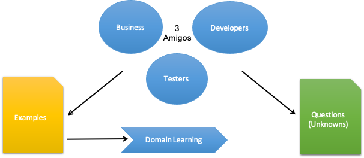
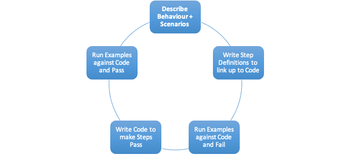

# Behaviour Driven Development Concepts

## What is Behaviour Driven Development (BDD)

BDD is about the conversation – Brings in the Developers



>"Behaviour-Driven Development is about implementing an application by describing its behaviour from the perspective of its stakeholders"
>
>(Chelimsky, David; Astels, Dave; Helmkamp, Bryan; North, Dan; Dennis, Zach; Hellesoy, Aslak. The RSpec Book: Behaviour Driven Development with RSpec, Cucumber, and Friends)

Involving the 3 amigos allows for the development of the key examples adding to the domain learning and crucially the knowledge of the "known unknowns"

## Behaviour Driven Development Process



As you can see for the diagram above, Behaviour Driven Development (BDD) is an iterative process allowing change. It begins with the definition of  a requirement as a feature and the specification of the behaviours in terms of scenarios. This is written in a ubiquitous language like Gherkin but is essentially a set of English sentences using a common set of keywords.

Each feature can be exported into a feature file where a developer can use it to link up to the software they are developing. To do this they write a specialist script called a step definition. The step definition references the features and scenarios described in the feature file and then hooks into the actual software that is being developed and performs relevant tests based on whatever the scenario requires.

Here's the strange bit. They actually do this before they have even written the software so initially all of the tests fail. As they write more of the code, more of the BDD scenarios pass and eventually the whole story passes.

---

## Living Documentation

Use a ubiquitous language understandable to all stakeholders

Expressing requirements as a set of *Features*

Express Acceptance Criteria as a set of *Scenarios* (Examples)

- Each scenario provides an example to illustrate how the *Feature* should work

Gherkin is a common language used to define *Features* and their *Scenarios*

**Given ...**
**When ...**
**Then ...**

---

## Applying Gherkin to Acceptance Criteria

### Customer Requirement

> Books can be added to the cart

Gherkin would describe the criteria more formally as:

**Given** my shopping basket is empty...
**When** I add the book "BDD is Fun" to the basket...
**Then** the shopping basket should contain 1 copy of "BDD is Fun"

## Defining Examples with Gherkin

Uses the following keywords:

- Feature
- Background
- Scenario
- Given
- When
- Then
- And
- But

### Feature

**Feature**: describes the functionality to be developed along with the business goal it fulfils.
The Feature the user story is contributing to:

- **Title** - Brief and to the point
- **Business Goal** - (optional) What is the Business Purpose – "In order to"
- **Description** - In Connextra Format "As a"

Followed by:

- **Scenarios** – Illustrate specific examples of how the feature should work

Scenario takes the form of:

## Defining Scenarios

| Situation        | Specific to feature           | Description                                      |
| ---------------- | ----------------------------- | ------------------------------------------------ |
| Scenario         | \<name\>                      | Concise title                                    |
| Given            | \<assumption/context1\>       | Assuming a current state or context              |
| And              | \<assumption/context2\>       | Additional context clauses                       |
| When             | \<event occurs\>              | When specific event(s) occur                     |
| And              | \<additional events occur\>   |                                                  |
| Then ensure this | \<outcome occurs\>            | The following result(s)/outcome(s) should happen |
| And this         | \<additional outcome occurs\> |                                                  |

Each *Scenario* then takes the form of a sequential number followed by a name
Given indicates the current state or context of the domain when one or more events occur, then a set of results or outcomes are expected to happen.

Multiple *Scenarios* can illustrate a requirement

- Using a simple ubiquitous language across all teams within the business
- Sets of *Scenarios* used to illustrate how a feature should respond in differing circumstances
- *Scenarios* are relevant to actors and stakeholders
- Each *Scenario* can be traced through to one or more tests

*Scenarios* (or examples) allow us to illustrate all of the possible things that could happened and the circumstances in which they could happen.

The reason why it is so powerful is because if we use a common language to define our *Scenarios* they can be linked directly to automated testing via a bit of clever development cross wiring.

Behaviour Driven Development means the behaviour is defined as sets of *Scenarios* and linked through directly to development. In essence the behaviour definition is driving development.

## Writing Scenarios

Best to start with the "Happy Path" *Scenario*:

>Given my shopping basket is empty
>
>When I add the book "BDD is Fun" to the basket
>
>Then the shopping basket contains 1 copy of "BDD is Fun"

Then add alternative "edge" *Scenarios* based on established acceptance criteria:

>Given my shopping basket contains the book "BDD is Fun"
>
>When I add another copy of  book "BDD is Fun" to the basket
>
>Then the shopping basket contains 2 copies of "BDD is Fun"

We usually start with the *ALL is Well* *Scenario* and then add in the edge scenarios to demonstrate the variations of behaviour.

### Example

**Feature**: Shopping Basket

```bash
    In order to facilitate online shopping

    As a customer
    I want to be able to build up a shopping basket of books
    So that I can order several books at once

        Given my shopping basket is empty
        When I add the book "BDD is Fun" to the basket
        Then the shopping basket contains 1 copy of "BDD is Fun"
```

### Rules of Thumb

- Write in Present Tense
- Always use Business Language!
- Express the clauses as readable sentences
  - Avoid truncated statements – brevity can create ambiguity
- OR doesn't Exist
- One Feature per story
  - Keep Scenario count to approx. 12 max per feature
- Style
  - Always Capitalize Gherkin keywords Given, When, Then
  - Capitalize all titles

### Validating your Scenario

Having established a Scenario you can validate it by asking these questions:

- What is the intent?
- Have we understood the expected behaviour?
- Is the expected behaviour clearly expressed?
- Can the rule be clearly understood when reading the scenario?
  - Is there enough detail? Is it too declarative
  - What does "sufficient" or "valid" actually mean
- How many rules are defined in the scenario
  - Ideally it's just one

### Examples

### Scenario - Account is in credit+

- **Given** the account is in credit
- **And** the card is valid
- **And** the dispenser contains cash
- **When** the customer requests cash within their balance
- **Then** the account is debited
- **And** cash is dispensed
- **And** the card is returned

### Scenario - Account is overdrawn past the overdraft limit+

- **Given** the account is in credit
- **And** the card is valid
- **When** the customer requests cash in excess of their balance
- **Then** a rejection message is displayed
- **And** cash is withheld
- **And** the card is returned

---

## Writing Scenarios with Data

Scenarios can include data to be more illustrative:

>**Given** the customer has 100 in checking
>
>**And** the customers has 20 in savings
>
>**When** 15 is transferred from checking to savings
>
>**Then** there is 85 in checking
>
>**And** there is 35 in savings

Can also use tables:

**Scenario** Outline:

```bash
    Given the input "<input>"
    When the calculator is run
    Then the output should be "<output>"

    Examples

    | input   | output |
    | ------- | ------ |
    | 2+2     | 4      |
    | 98+1    | 99     |
    | 255+390 | 645    |
```

---

## Scenario Style

You will often see scenarios written out using one of two styles: Imperative and Declarative.

Imperative is usually more prescriptive, longer and more minutely detailed. It takes less for granted. This style will force developers working with the scenario to write link up code at a much lower level of granularity. This can be beneficial because it means the scenario writers can write many variations on the same scenarios to test different kinds of conditions. It's often also easier to work in new scenarios without a lot of extra development effort.

Declarative Style is less prescriptive and allows the developers to write specific links to individual scenarios. This gives less flexibility to the scenario writer.

### Comparing Imperative and Declarative Styles

### Imperative Style

Imperative style requires the scenario writer to include more low level detail which ultimately gives greater flexibility.

- What should happen including a detailed description of the steps
- Developers write matching step definitions at a lower level
- Low level step definitions are often reusable from other scenarios
- Less readable/harder to understand overall

### Declarative Style

Declarative style is often higher level and less flexible.

- What should happen not necessarily how its achieved
- Less detail, more generalised style
- Developers write write higher level step definitions
- Step definitions are less reusable and more specific to the scenario
- More readable/easier to understand

| Imperative                                       | Declarative                                     |
| ------------------------------------------------ | ----------------------------------------------- |
| **Given** I have 100 in checking                 | **Given** I have 100 in checking                |
| **And** I have 20 in savings                     | **And** I have 20 in savings                    |
| **When** I go to the transfer form               | **When** I transfer 15 from checking to savings |
| **And** I select "Checking" from "Source"        | **Then** I should have 85 in checking           |
| **And** I select "Savings" from "Target"         | **And** I should have 35 in savings             |
| **And** I fill in "Amount" with "15"             |                                                 |
| **And** I press "Transfer"                       |                                                 |
| **Then** I should see that I have 85 in checking |                                                 |
| **And** I should see that I have 35 in savings   |                                                 |

### Using Backgrounds in Scenarios

To avoid repeating the same clauses continually use Background.

- Don’t use Background to set up **complicated states**, unless that state is actually something the client needs to know.
  - For example, if the user and site names don’t matter to the client, use a higher-level step such as Given I am logged in as a site owner.
- Keep your Background section short.
  - The client needs to actually remember this stuff when reading the scenarios. If the Background is more than 4 lines long, consider moving some of the irrelevant details into higher-level steps.
- Make your Background section vivid.
  - Use colourful names, and try to tell a story. The human brain keeps track of stories much better than it keeps track of names like "User A", "User B", "Site 1", and so on.
- Keep your scenarios short, and don’t have too many.
  - If the Background section has scrolled off the screen, the reader no longer has a full overview of whats happening. Think about using higher-level steps, or splitting the *.feature file.

>**Background:**
>
>**Given** the user has entered a valid pin
>
>**And** the account is open
>
>**Scenario:** User transfers cash from Savings to Checking
>
>**Given** I have 100 in checking
>
>**And** I have 20 in savings
>…

## Writing User Stories

A user story usually contains:

- Definition
- Acceptance Criteria

Definition typically use the "Connextra" format:

As a X
I want Y
So that Z

Where

- X is a person, "persona" or role
- Y is a an action to be performed or feature
- Z is a benefit

### Acceptance Criteria

Conditions that have to be satisfied for the story to conclude successfully

- Defining Done
- Makes the story testable

Required set of criteria to be met as specified by:

- Product Owner
- Stakeholders
- Designers/ArchitectsDevelopment Team

### The Power of Examples

User Stories with raw acceptance criteria can miss the overall intent

Examples of how it should work makes things clearer:

- "In the best case scenario this is how it should work"
- "It could also work like this"
- This could even happen! This is what the response should be

Illustrates:

- What could happen
- Under what circumstances it might happen
- What should be done when it happens

Requirements and acceptance criteria written in a pure narrative form can be ambiguous. However examples of how a process should work based on different scenarios is often much more illustrative and covers many more likely eventualities than could ever be communicated using a raw textual description.

---

## Cucumber and Gherkin

### What is Cucumber

According to the [documentation](https://cucumber.io/docs/guides/overview/):

> Cucumber is a tool that supports Behaviour-Driven Development(BDD).
>
>Cucumber reads executable specifications written in plain text and validates that the software does what those specifications say. The specifications consists of multiple examples, or scenarios. For example:
>

```bash
  Scenario: Breaker guesses a word
    Given the Maker has chosen a word
    When the Breaker makes a guess
    Then the Maker is asked to score
```

> Each scenario is a list of steps for Cucumber to work through. Cucumber verifies that the software conforms with the specification and generates a report indicating ✅ success or ❌ failure for each scenario.
>
>In order for Cucumber to understand the scenarios, they must follow some basic syntax rules, called Gherkin.

Cucumber can be used in almost any development language.

It can be downloaded and installed from [cucumber.io](https://cucumber.io/docs/installation/).  Note that the downloads are rated as:

- Official - hosted by cucumber
- Semi-Official - hosted elsewhere but use components from cucumber
- Unofficial - hosted elsewhere and don't use any components from cucumber
- Unmaintained - official implementations but unmaintained

### Breaking scenarios down into Step Definitions

```bash
    Scenario
        Given the balance is 500
        When the user withdraws 200
        Then the balance is 300
```

This can then be put into actual code.

---

#### Step Definition

```java
@Given("the balance is $bal")
public void setBalance(double bal) {
    myCal=new Calculator(bal);
}

@When("the user withdraws $amount")
public void withdrawAmount(double amount) {
    myCal.Withdraw(amount);
}

@Then(" the balance is $bal")
public void testResult(double bal) {
    Assert.assertEquals(bal, myCal.getBalance());
}
```

A feature broken down into its constituent scenarios is linked to step definitions that are typically written in a programming language such as Python, Ruby, JavaScript, Java or C#.

The step definitions may use a driver library that can talk to a web browser or a mobile phone simulator and simulate touches, mouse clicks or key presses. They can just as easily link directly to code as unit tests or test of web services or micro services.

In the example above the step definition is using a bank account class and checking that the balance that is being used to initialise it is in fact setting the balance property of the account.

Notice how the value 500 is being passed in from the scenario to the step definition `step_set_balance` as a parameter called `newBal`.

There are intermediary steps between Gherkin Scenarios and Code or User Interfaces via an UI automation api.
Many Dev environments provide utilities to generate step definitions from the Gherkin script.
Step Definitions can be reusable with the intelligent use of parameters.

```java
@When("the user withdraws $amount")
public void withdrawAmount(double amount) {
    myCal.Withdraw(amount);
}
// becomes@When("the user $action $amount")
public void withdrawAmount(string action, double amount) {
    if (action == "withdraws"){
        myCal.Withdraw(amount);
    } …
}
```

### Executing Gherkin Scripts

This can be done from:

- The command line using a *cucumber* engine
- From with the Dev Environment as unit tests (if the IDE supports it)

---

## Automation

Developers use a Cucumber engine to run Gherkin

Engine may link to an Framework to talk to:

- Browsers, Simulators etc.
- Web Developers can use Selenium to hook into Browsers
- Step Definitions run commands via Selenium Api
- Mobile Developers use tools like Appium

For Web Testing the automation engine often used is **Selenium**. In mobile testing it's **Appium**.
