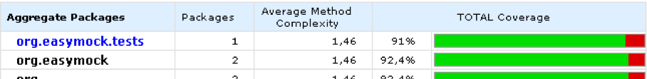
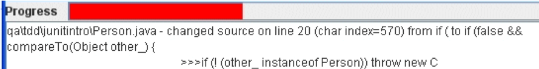
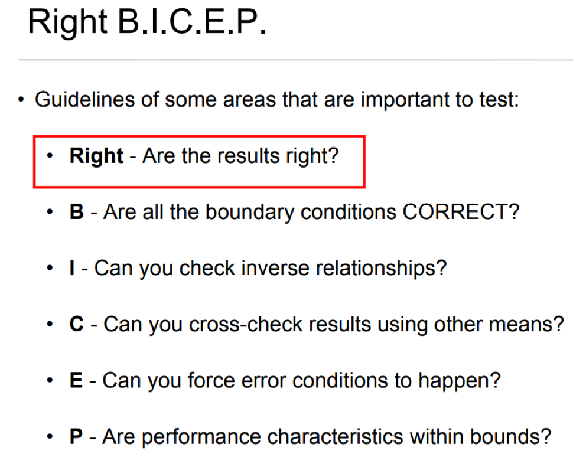

# Code Coverage

## Coverage: How well do the tests cover the code base?

- White box tests mean every line should be covered
- Clover – integrates with JUnit, Eclipse, etc.
  - Shows e.g. classes with highest risk = greatest complexity and least test coverage
  - High-level summaries and line-by-line analysis of source code

Other tools include: Istanbul (for Javascript)

What percentage acceptable?

- Ordinary development: struggle to get to 90%
- TDD: should naturally be at least 90%

---

## Coverage Metrics

1. Method Coverage
    - % of methods covered
    - Very coarse-grained, i.e. inaccurate
2. Symbol coverage
    - % of sequence points (statements) have been exercised
3. Branch coverage
    - % of completely executed blocks in a method
4. Cyclomatic complexity
    - How many linearly independent paths through the code are there
    - Code with no if decision points has cyclomatic complexity 1
    - Code with one if has 2 linearly independent paths (1 for true; 1 for false)

Method coverage simply reflects how many methods are touched by a test – i.e. at some point, so no real indication of how well the method code is covered.  

Symbol coverage is better, but doesn’t show e.g. if both sides to an `if` (bool condition) have been tested

Branch coverage is higher-level than Symbol coverage (1 block can have multiple statements).  But also more accurate, in that e.g. both true and false sides to an if (…) will be checked.  

Cyclomatic complexity reflects the number of tests to get 100% Branch Coverage.  It is recommended that methods with cyclomatic complexity >= 15 are too complex , and so should be refactored.

---

## Coverage: percentage isn't everything

- Method may be covered, but have all the edge/corner cases been adequately tested?
- There are test generation tools which auto-generate unit tests with 100% coverage, but the tests are worthless
- With get/set methods which simply read/write a field, does it add value to cover these?
  - End up with a Test class full of trivial testGet/Set methods which make it hard to see where the tests with real value are
  - Consider creating testGet method only as a helper “getting things set up test”, and delete it when it’s served that purpose
- Failing test counts towards coverage the same as passing test

Use coverage tools primarily as a means to detect regions of code which are not tested.

>"Ask yourself which bits of the program would you be scared to change? One test I've come up with since the Refactoring book is asking if there is any line of code that you could comment out and the tests wouldn't fail? If so, you are either missing a test or you've got an unnecessary line of code. Similarly, take any Boolean expression. Could you just reverse it? What test would fail? If there's not a test failing, then, you've obviously got some more tests to write or some code to remove." – Martin Fowler in conversation with Bill Venners [Test-Driven Development](http://www.artima.com/intv/testdrivenP.html)

Emma is one example of a code analysis tool: keep running it to ensure there are no regions of your application code which have not be tested.  Other tools check for conformity to coding rules, such as PMD and checkstyle.  CodePro Analytix is a very powerful suite of code analysis tools which has been made freely available by Google.  Not only measuring code coverage and cyclomatic complexity, you can also use it to detect regions of duplicated code, analyse dependencies between classes, etc.  See: [https://developers.google.com/java-dev-tools/codepro/doc/]

>"100% test coverage does not guarantee that your application is 100% tested" – Massol

Test quality: how demanding are the tests?

Jester: randomly mutates source code

- Mutates source and recompiles, so very slow
- Important that tests run fast, so use Jester in targeted manner
- Many false positives

*Jester*, the JUnit test tester, is at http://jester.sourceforge.net/

While Jester highlights the fact that raw coverage percentage is not everything, in practice it produces such a high number of false positives (identifies changes to source code which don't cause any tests to fail), that its results will tend to be discounted.  

However, see Elliotte Rusty Harold's article, http://www.ibm.com/developerworks/java/library/j-jester/

It is easy to think that the more tests you have, the better

- This can cause the feedback cycle to slow down
- Maintenance costs grow
- Eventually brings diminishing additional value

To try and avoid the scenario above

- Avoid test duplication
- Identify what tests are necessary

---

## Coverage - What to test? Use Right B.I.C.E.P

Guidelines of some areas that are important to test:

- **Right** - *Are the results right?*
- **B** - Are all the **B**oundary conditions CORRECT?
- **I** - Can you check the **I**nverse relationships?
- **C** - Can you **C**ross-check results using other means?
- **E** - Can you force **E**rror conditions to happen?
- **P** - Are **P**erformance characteristics within bounds?

Please see [Emma and Eclemma for Java](./Appendix_1_EmmaEclemmaForJava.md) for a example.
