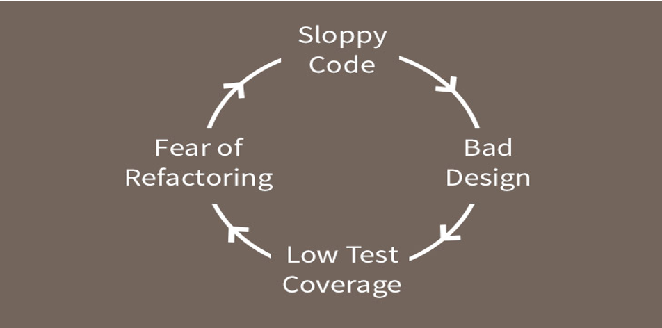

# Dealing With Legacy Code

## Legacy Code

Code without tests is a ‘definition’ of **legacy code**

### Refactor or rewrite the code?

Is it better to refactor the code or to rewrite?

- Lots of developers enjoy rewriting the code rather than fixing existing code
- A total rewrite only makes sense if you fully understand the full requirements of the system
  - The existing codebase could be so huge and a complete mess that actually refactoring it would be more trouble than it is worth
- Refactoring requires you to fully understand the codebase
  - If it’s poorly written it is going to be difficult to read and understand

See [this Medium article](https://medium.com/@sergioserra/application-refactoring-vs-rewrite-eaa25d9eea4d)

When faced with the task of updating a legacy system we can apply the following options:

- Leave the old code alone and write more legacy code
  - This is a very common approach but also the wrong approach as it makes the code harder to update and maintain
- Set some time and resources aside to completely rewrite the system from scratch
- A final option and less intrusive would be to approach the system in a pragmatic way and slowly and incrementally improve it

Good read here: [Modern Approach to Legacy Code](https://blog.bugsnag.com/modern-approach-to-legacy-code/)

Good resource book: [Working Effectively with Legacy Code](https://www.amazon.com/Working-Effectively-Legacy-Michael-Feathers/dp/0131177052)

---

## Seams

Allow for substitution of classes and functions

### Object Seams

Dependency Substitution based on either inheritance or interface implementation

### Linker Seams

Different Builds can be defined by varying the `classpath`

- For package class `com.qa.mainframe` we could:
  - Define a substituted set of classes within the package
  - Change the `classpath` to create two different builds

### Pre-processor Seams

Based on pre-processor directors managing substitution
Requires a pre-processor

### Example

Based on the substitution principal:

```java

public void ProcessAccount(AccountProcessor proc, Account acc)
{
}

// …other cocde

class TestAccountProcessor: public AccountProcessor
{
    // Substitute implementation
}

```

For legacy code:

- Change the smallest amount of code possible
- Don't change, substitute when possible

```java

ProcessAccount(new TestAccountProcessor(),new Account())

```

---

## Refactoring with little or no test coverage

- Code that has little or no test coverage is usually badly designed
- Makes it hard to know if your code changes with break other parts of the application
- This makes it harder to write tests


Image from: [https://codeclimate.com/blog/refactoring-without-good-tests/]

- It is usually a good idea to have unit tests in place before you start to refactor some code
- It is sometimes necessary to refactor without having unit tests
- Code that doesn’t get refactored maybe because you have been told not to refactor code if it has no unit tests
  - In this case, the code stays unimproved as individuals put in the effort of creating unit tests before the code can be refactored – the effort here is then too high
- Automatic refactoring
  - Many tools have refactor options built-in, for instance, in Eclipse-IDE right click on a source file and select the refactor option
- Small step refactoring
  - Make very small simple steps that are so trivial, there is almost no chance of making a mistake, this can end up making a big refactor as the whole effect of keep making small steps is the net effect

Some notes taken from: [https://simpleprogrammer.com/living-dangerously-refactoring-without-a-safety-net/]
