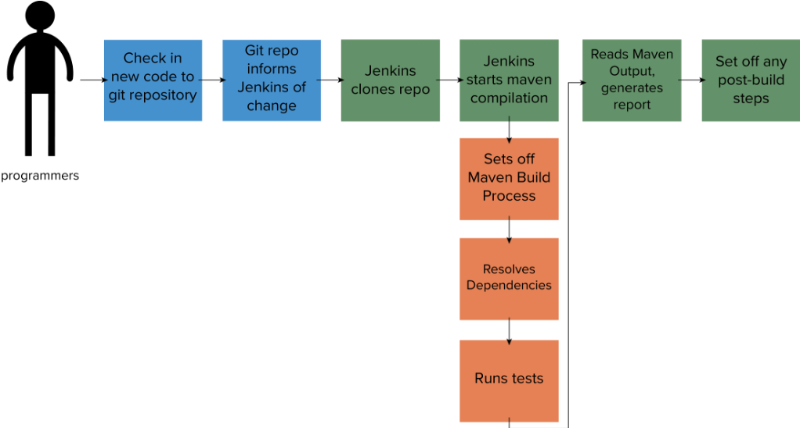
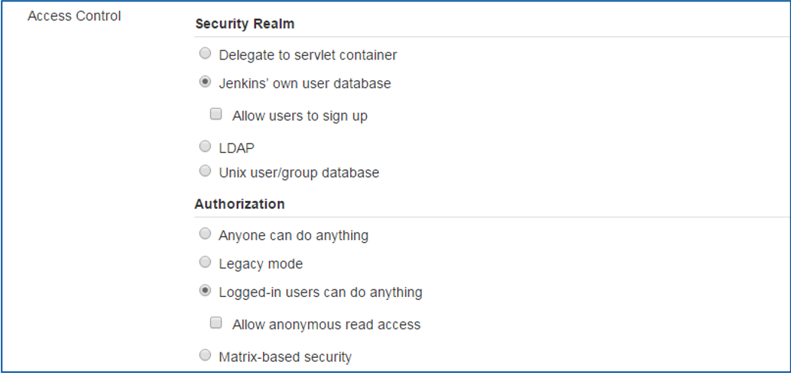
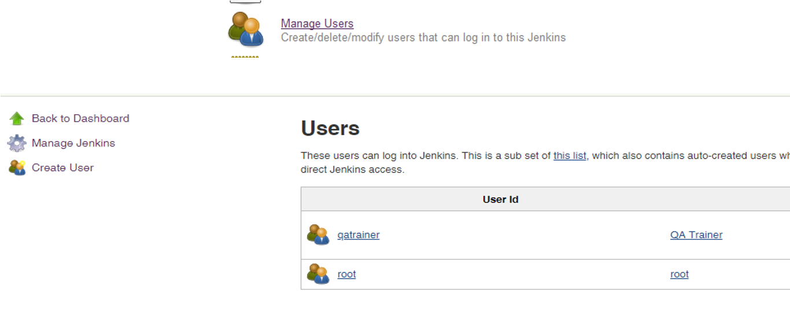
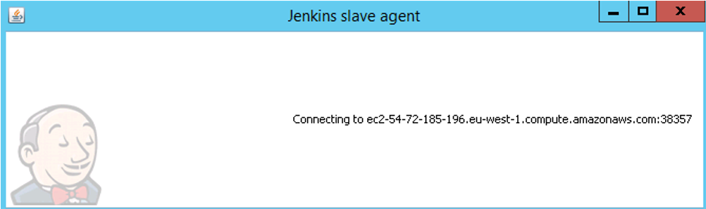
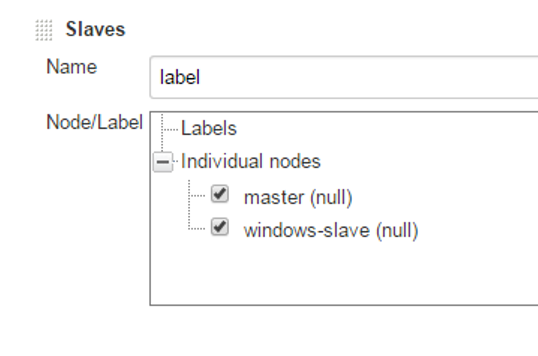

# Jenkins Concepts

## Introducing Jenkins


- First released in 2005 as the Hudson project
  - Created by Sun Microsystems
  - Oracle bought the company and so had control of the Hudson name
  - Name changed to Jenkins for the open source project
  - Both the Hudson and Jenkins project are still active but development has diverged

- Created as a CI/CD tool
  - Aim was to be easy to install and use
  - Plugins to connect to source control
  - Builds projects using the project setup – so can work with any language
  - Public/company facing dashboard lets everyone know the status of the current build

## What does Jenkins do

Jenkins is a one stop shop for testing and building code. It can even deploy code onto servers if they already exist.

Usual workflow:

- Developer checks some new code into Git
- Git informs all watchers that it has updated
- The Jenkins git plugin starts the build process
- Clones the project
- Compiles, runs tests
- Updates the dashboard with any feedback
- Start the post-build steps or actions to deploy



## Why is it popular

- Allows companies to follow some of the best practices for CI/CD
  - Automate the build
  - Make the build self testing
  - Keep the build fast
  - Make sure everyone can see the results of the build
  - Automate deployment
- Easy installation and config
  - Can be done all through the GUI – no need for more XML files
- Many plugins available for any combination of source control, compiling, testing and deployment
  - Still a very active project!
  - IDE Integration, orchestration tools, style checkers

## Distributed Jenkins Servers

- Jenkins uses agents to scale systems
  - By default there is one agent which will build using one core
  - May need to build for different architectures
    - Windows/Mac/Linux
    - Android/iOS/Windows Phone
- Master/Node servers
  - Can exist anywhere
- Single report can be generated over all the builds

---

## Securing Jenkins

- Security is enabled by default in Jenkins 2.0+
  - Originally, Jenkins would allow anyone to create and build jobs
- You want to restrict who can trigger new builds and setup new jobs on your server
  - Otherwise random people on the internet will be able to use your build server!



### Access Control

- Jenkins can hook into existing systems
  - Unix user groups
    - Either Jenkins needs to run as `root` or User `jenkins` needs to belong to group `root` and `chmod g+r /etc/shadow` needs to be done to enable Jenkins to read `/etc/shadow`
- LDAP
  - Lightweight Directory Access Protocol
  - Use existing logins for Windows
- Jenkin’s own user database
  - We can allow users to sign up or restrict this
  - When you first access Jenkins it will let you set an initial username and password
- Authorization
  - Logged in users can do anything – covers most cases
  - You can enable project based security if required

### Manage Users

Add users manually from the `Manage Jenkins` menu



---

## Distributed Jenkins

- Jenkins runs builds using different agents, or threads on a machine
  - By default there are two threads available for use
- When we have large projects we may need more capacity
  - Single machine will run out of memory/CPU capacity
  - Jenkins can run as a distributed system with a single master controlling one or more nodes
  - Build a project on multiple operating systems or architectures
- Jenkins offers different ways to manage nodes
  - Launch node via SSH (usually on unix systems)
  - Control Windows as a service
  - Launch via Java Web Start
  - Write our own script to launch it

### Advantages to distributed builds

- One server can handle multiple projects
  - Single point to see how the builds are going
- You can specify jobs to target specific machines
  - You may want one job to build on Windows only
  - Can identify specific nodes by name to use
  - Alternatively, you can leave the pool open and the master will select which node to use
- Not a lot of overhead for setting up
  - Jenkins does not need to be installed on the node
  - Can pull more online or take them offline easily
  - Jenkins can automatically install all the tools it needs

### Scheduling and Node Monitoring

- Jenkins always follows some rules when working out which node to use
  - Use a machine the project is configured to stick to
  - Use the same computer that the project was built on before
  - Long builds are moved to nodes
    - (This is also good practice!)
- The master can monitor the health of any connected node
  - See if builds over many projects fail on this node
  - Check disk space/capacity, response time etc.
  - Can pull nodes offline if there is a problem
  - Plugins can add more monitors

---

## Setting up a Distributed Build

### Setting up the Master

- From the main dashboard
  - Manage Jenkins
  - Manage Nodes

- Add a new node
  - Your first will always be a permanent node
  - Others can copy this configuration if they want
  - Number of executor threads can be set
  - You need to specify a directory for Jenkins to use on the node
    - `/home/ec2-user/jenkins`
    - `C:\jenkins`
- Usage – say how much you want to use the node
- Launch Method – How you want to control the node
  - Java web start is the easiest for Windows hosts

### Windows Nodes

- We can run the node program via Java Web Start or through installing a service
  - Setup the node on the master
  - Go to the link given by the master on the remote machine
  - Click the Java Web Start button
- If you already have Jenkins installed as a service we can connect directly to the machine using a username and password
  - Not recommended – prone to bugs
  - Better to use the Java Web Start


### Linux Nodes

- Needs to have SSH password access enabled
  - Make sure you install Git!

```bash
#Add user
$ sudo adduser jenkins
$ sudo passwd jenkins

#Change the SSH login – Set PasswordAuthentication to yes
$ sudo vim /etc/ssh/sshd_config

#restart the service
$ sudo service sshd restart
```

- Then when you create a node give it the username, password and IP address of the host

### Collating the results

- We can have multiple jobs for one source repository
  - Define which machines to build on
  - Separate success/failures
- Combine them with multi-configuration (Matrix) projects
  - Allow you to build the same project using more than one node
    - Concurrent or consecutively
  - When configuring the project you get to decide which nodes to use
  - Jenkins will take care of the rest – including setting up maven (and the JVM if you have an oracle account) on the target machines


---

## Jenkins Best Practices

- There are a set of best practices for using Jenkins on their site:
  - [https://wiki.jenkins-ci.org/display/JENKINS/Jenkins+Best+Practices](https://wiki.jenkins-ci.org/display/JENKINS/Jenkins+Best+Practices)
- Always secure Jenkins
  - Don’t leave your server open to abuse by others
  - At least enable Jenkins’ own user database
- Backup Jenkins’ Regularly
  - We have the *scm sync mod* doing this for us now!
- Use **"file fingerprinting"** to manage dependencies
  - Keep track of which version of each project is used by what
- The most reliable builds will be clean builds, which are built fully from Source Code Control
  - Enable the build to be pulled directly from git
  - Don’t include pre-compiled files if you can get away with it
- Integrate tightly with your issue tracking system, like *JIRA* or *bugzilla*, to reduce the need for - maintaining a Change Log
  - Hooray for *JIRA*!
- Integrate tightly with a repository browsing tool like *FishEye* if you are using *Subversion* as source - code management tool
  - *Subversion* is slower than *Git*. This allows Jenkins to quickly work out what has changed since the - previous build
- Always configure your job to generate trend reports and automated testing when running a Java build
  - Maven will run tests automatically if we use the package command
- Set up Jenkins on the partition that has the most free disk-space
  - Running out of disk space is awkward
  - Jenkins can keep all the settings, logs and builds in the JENKINS_HOME directory for use later
- Archive unused jobs before removing them
  - You can always resurrect a job, but you can’t undelete it
- Setup a different job/project for each maintenance or development branch you create
  - Detect problems quickly when developing in parallel
  - Or use the matrix project
- Allocate a different port for parallel project builds and avoid scheduling all jobs to start at the - same time
  - Your system will grind to a halt at 10pm if you do daily builds at that time
  - Stagger the process
- Set up email notifications mapping to ALL developers in the project, so that everyone on the team has their pulse on the project's current status
  - Everyone should know the status of everything!
- Take steps to ensure failures are reported as soon as possible
  - Hiding doesn’t help!
  - All hands on deck to fix failures in the build or the pipeline
- Write jobs for your maintenance tasks, such as cleanup operations to avoid full disk problems
  - Not strictly Jenkins related, but we can create cron jobs to deal with some of these bits
  - Good housekeeping!
- Tag, label, or baseline the codebase after the successful build
  - Everyone knows which version they are looking at or demonstrating
- Configure Jenkins bootstrapper to update your working copy prior to running the build goal/target
  - No point building out of date code
- In larger systems, don't build on the master
  - We have other nodes for this
  - Set the executor count to zero on the master
