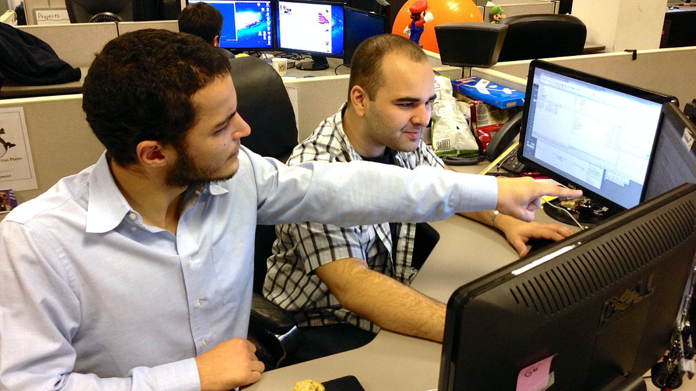

# Pair Programming Concepts

Image: By Kabren - Own work, CC BY-SA 3.0, [https://commons.wikimedia.org/w/index.php?curid=21903816]

Pair programming is a technique where upon two developers work together as peers.  The developers have co-responsibility for developing quality code of high value.  During implementation, one developer codes while the other critiques, provides guidance, or conducts research. This is an effective strategy to identify bugs, design problems, and maintain coding standards. The developers can switch roles occasionally where the other person codes.

## Benefits of pair programming

* Increased confidence
* Increased productivity
* Cross learning
* When resolving complex issues, pair programming can be particularly useful
* Reduced training costs and time – developers are also trainers
* Guaranteed focus – people really focus on productive coding
* Fewer blockages – learning from each other
* Continuous code reviews
* Multiple points of view
* Could reduce bugs and give feedback more quickly

---

## Why Pair Programming

* Back up each other
  * What if member is sick or on annual leave
    * Pair programming is a good solution for this
* Improve the code quality
  * Two individuals could find the best algorithm for one problem
  * During pairing, the person observing can challenge the coder and point out better ways to do the code or point out errors
* Knowledge Transfer
  * Pair programming reduces the learning curve for new people
  * People can learn from each other
  * Everyone can become and expert from shuffling the pairs around
* Share responsibilities
* Enhanced trust of each team member

---

## Some Types of Pairing

### Driver-Navigator

* Arguably most established style
* Driver focuses on tactical concerns related to mechanics of activity
  * Does typing, handles files, basic code implementation and syntax
* Navigator thinks about the big picture
  * Looks at broader concerns and checks for mistakes

### Backseat Navigator

* Can look like Driver-Navigator but navigator is more tactical
* Driver will type but not make as many decisions
* Navigator will decide on code structure and naming as well as file management

### Tour Guide

* Guide does all of the work - typing and explaining what they are doing
* Tourist rarely intervenes
* Can work both expert guide and novice tourist and vice versa, with the tourist correcting when the expert
  
### Ping-Pong

* Used within TDD and XP
* First person writes a failing test and the second person writes code to pass
* Then second person writes a failing test and the first person gets it to pass
* This continues until the user story is complete (like a game of ping-pong)

#### Notes about Ping-pong

* There are two basic forms of ping-pong, but they both share on very important aspect: both members are writing code frequently
* The first style of ping-pong is where one member takes on the role of test writer, and the other takes on the role of getting the tests to pass
* This is done by having the first member write a test, then control is passed to the other member. That person gets the test to pass, to turn green, then they are immediately responsible for writing the next test.

#### Notes about Driver-navigator

* The Driver, has the keyboard and control of the input. Their job is to type and focus on the minute-to-minute coding. The other member is The Navigator. Their job is to pay attention to the code being written

See: [http://articles.coreyhaines.com/posts/thoughts-on-pair-programming]

---

## Some Types of pairing

### Cross-functional

* Used in embedded system development
* One programmer would work with one hardware engineer
* Allows more time to work alone
* Ideal for use in new system being developed

### Distributed

* Works when members of the team are in different geographical locations
* More tiring than traditional pair programming (more hours)
* Tools used include: Mikogo, Trellis, Yuuguu

Others: Selective pairing, Keyboard'n'mice pairing, novice-novice, guru-guru
