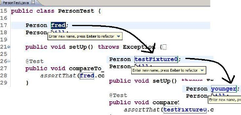
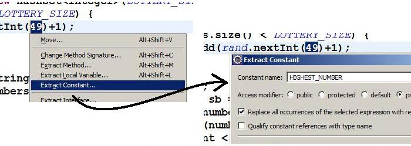
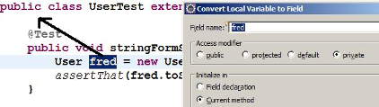
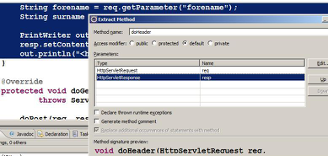
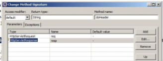
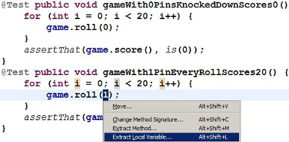
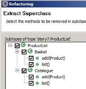
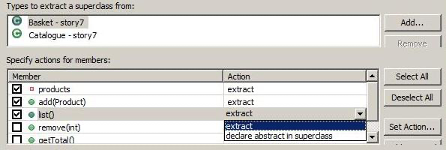
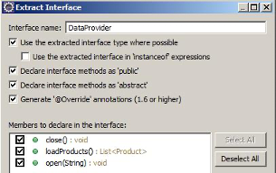
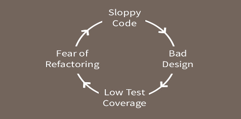

# Refactoring With Existing Tests Concepts

## Principles of Refactoring

There are 4 key principles involved in refactoring:

1. Keep it small
   - Refactor in small increments, this creates a modest overhead for the work in the team
2. Business Catalysts
   - When is the earliest we should refactor? Not whenever the tech team decides they want to do it
3. Team Cohesion
   - High level of communication and teamwork is required from the team. The teamwork applies just as in any other activity
4. Transparency
   - Team needs to be completely open with all stakeholders about what cost is involved in refactoring

Taken from: [http://www.agileadvice.com/2016/03/24/scrumxplean/refactoring-4-key-principles/]

---

## Benefits of Refactoring

- Makes code easier to understand
- Improves code maintainability
- Increases quality and robustness
- Makes code more reusable
- Typically to make code conform to design pattern
- Many now automated through Eclipse, etc.
- Refactoring ≠ Rewriting
- Improves the design of software
- Bugs are found quicker as code is cleaned up

**Koskela:**
> "Do. Not. Skip. Refactoring
> … The single biggest problem I've witnessed after watching dozens of teams take their first steps in test-driven development is insufficient refactoring." (Test Driven, p. 106)

Martin Fowler's site refactoring.com is a useful resource.  See e.g. the catalogue of refactorings at: [http://www.refactoring.com/catalog/index.html]

Another on-line catalogue of refactorings is available at: [http://industriallogic.com/xp/refactoring]

---

## Common Refactorings : Refactor-Rename

- Eclipse: `<ALT> <SHIFT> R`
- Keep doing until you are satisfied you have an identifier that best reflects what the item represents



At all times think how you can make your code maximally self-documenting.  Aim to replace unclear and ambiguous identifiers with clear and informative ones.  For a variable, choose a name which reflects what it represents in the problem domain, not its implementation (e.g. in the enhanced for loop, nextClient rather than nextElement).  Only choose one-letter identifiers for variables such as array indexes.  

Refactor-rename is much smarter than a manual edit of the file

- Rename a variable: renames all occurrences
- Rename a class: renames the compilation unit too (the .java file), and all known references to the class
- Rename a method: renames all known calls to that method
- Rename a package: renames all the package declarations within

---

## Common Refactorings : Extract Constant – aka “No Magic Numbers”

- Highlight literal (e.g. int or String), then `<ALT> <SHIFT> T`



- Convert Local Variable to Field



You should avoid hard-coding literal values, like `49`, into your code.  The essential issue is to do with the comprehensibility of the code: someone coming along to maintain it will be scratching their head wondering what this number represents.  There is also likely to be the issue of maintainability in the sense that quite likely this value will occur more than once, and maybe it will need to be revised.  

In Eclipse, highlight the number, then `<CTRL> <SHIFT> T`, the general context menu for refactoring.  Select Extract Constant, choose a meaningful name: the constant will be declared as a class field, and the literal occurrence you selected will be replaced.  NB if there are further occurrences of the value within the class, you need to search for them manually and replace them.  

For Convert Variable to Field, you highlight a variable local to a method so that you can pull it to class field level.  This could be part of a “remove duplication” refactoring – certainly in the case of a unit test fixture, as illustrated.  There are a couple of decisions to be addressed.  Since the variable is now a class-level field, what class accessibility should it have?  The options are:

1. field declaration – i.e. the whole line is in effect pulled out of the method;
2. in the current method – i.e. the declaration `User fred;` is pulled up to the class level and the initialisation remains where it is;
3. in the class constructors – i.e. as 2, but the initialisation statement will be moved to all and any constructors.  

None of these is quite right for a Test class, so best is to accept 2 then manually move it to `setUp()`.

---

## Common Refactorings : Extract Method

- Eclipse `<ALT> <SHIFT> M`
- To remove code duplication
- For maintainability - if method gets too long, break it up
- For clarity: move 1+ lines to a method which expresses the intent
  - Why is there this call `reader.readLine()` which does nothing?
  - Extract to method: `discardHeaderLine()`
  - Code becomes self-documenting; much better than comments



Here, for the purposes of illustration, we are going to extract some lines of code into a method, and then modify the method to make it as testable as possible.  We start with some servlet code (inside a `doGet()` or `doPost()` method):

```java
String forename = req.getParameter("forename");
String surname = req.getParameter("surname");

PrintWriter out = resp.getWriter();
resp.setContentType("text/html");
out.println("<h4>Author: " + surname + ", " + forename + "</h4>");
```

Eclipse detects that if it is to make a method out of this, it will need two input parameters, and will be void return type.  Notice the method signature preview at the bottom of the dialogue. When you click OK for the refactoring, those lines will be replaced by a call to your new method, i.e. `doHeader(req, resp)`;
Notice the greyed out option in the dialogue: Replace additional occurrences of statements with method.  If Eclipse had detected that elsewhere in this class, those same lines were repeated, this option would ensure that those lines would be replaced too.  

---

## Common Refactorings - Extract Method for Testability

- Highlight lines
- Invoke refactoring
- Enter new method name, check accessibility
- If necessary:
  - Introduce local variable for return value
  - Get method code to compute return value as appropriate
  - Return the return value and adjust method return type
  - Adjust the call to the new method
- Change method signature
- Make new method as cohesive as possible



The method initially created is void.  But we’re aiming for testability, so ideally what we want is a method that returns something to us.  With this kind of method, we can declare a String or StringBuilder local variable, build it up in the method, and return it rather than printing it out to the PrinterWriter out.  
What this also means is that the method will have no need for its second input parameter, the Response object from which the Writer is obtained, so we can use a second refactoring, Change Method Signature…, to make it simpler, more cohesive.  We will end up with:

```java
String doHeader(HttpServletRequest req) throws IOException {
    String returnValue = null;
    String forename = req.getParameter("forename");
    String surname = req.getParameter("surname");
    returnValue = "<h4>Author: " + surname + ", " + forename + "</h4>";
    return returnValue;
}
```

and adjust where it is called to

```java
    out.print(doHeader(req));
```

Now, we can mock the `HttpServletRequest` instance which is passed to it, and assert what string we expect out of it.  

---

## Common Refactorings : Extract Class

Remedy for large class:

- Break it into smaller classes with cohesive behaviour
  
Or if related functionality is in multiple classes put into dedicated class where easier to maintain

---

## Common Refactorings : Replace Inheritance by Delegation

### Aka Favour Composition over Inheritance

Suppose: `class Deck<Card> extends ArrayList<Card>`
Reasoning: a Deck is a list of Cards
Wrong: relationship is `has-a`, not `is-a`
Doesn’t expose unnecessary methods of `ArrayList`
Expose only methods a `Deck` needs, and delegate their implementation to the contained `ArrayList`

---

## Common Refactorings : Remove Duplication

### DRY: Don’t Repeat Yourself

E.g. 2 blocks of code which are almost identical:

- Extract value(s) where they differ to variable(s)
- Will become input parameter(s) to single common method
- Place declaration of local variable `int pins = 1` outside loop
- Apply Extract Method refactoring to for loop



This example (a variant of the one in Bob Martin’s Bowling Game Kata), the test methods would end up looking like:

```java
@Test public void gameWith0PinsKnockedDownScores0() {
    roll20(0);
    assertThat(game.score(), is(0));
}
```

with the commonality between the two blocks of code captured in the method:

```java
private void roll20(int pins) {
    for (int i = 0; i < 20; i++) {
        game.roll(pins);
    }
}
```

You don't need to be an adherent of TDD or XP to recognise the importance of Remove Duplication.  Duplication of logic or responsibility is anathema to good code, because of the risks it introduces for maintenance: the risk of making a change in one place but not another.  

---

## Common Refactorings : Extract Superclass

- Another “Remove duplication” refactoring
- Suppose Basket and Catalog have commonality
  - Both have  a List of Products, methods to `add()` and `list()`
- Choose one, e.g. Basket -> Extract Superclass…



- Add the other (Types to extract a superclass from)
- Select methods, fields to be extracted…
- Basket, etc. will extend new superclass



Eclipse has a three-step wizard for the Extract Superclass refactoring.  

1. Give a name to the superclass to be created, e.g. ProductList.  If you already have the second class about to become its subclass, in the “Types to extract a superclass from” add it.  And check off the members which will be pulled into the new superclass.
2. Explicitly check off which methods are to be removed from the soon-to-be-subclasses.
3. Preview the changes.  

In performing code reviews, I have come across:

- The identical method in classes in “adjacent” packages (i.e. package a.b.c.m and a.b.c.n)
- Two methods that differ in only a couple of String values
- Two methods which differ in their parameter lists by types ABC and XYZ, where these have a common supertype
- Two methods or constructors, the bulk of whose definitions are identical, but differ in that one has an extra parameter

---

## Common Refactorings : Coding to Interfaces

Suppose a class needs a Repository/DAO:

```java
CSVFileProvider provider = new CSVFileProvider();
```

- Candidate for decoupling interface & implementation
  
```java
DataProvider provider = new CSVFileProvider();
```

- Can plug in different implementations w/o affecting rest of code
- Choose method names which are neutral about data source
- Choose exception type at same level of abstraction



Coding to interfaces is widely seen in uses of the Collections API:

```java
List<Product> products = new ArrayList<Product>();
```

If you look in the API docs for `java.util.List`, you will see declared there all the sorts of operations you could want to perform on a list-like data structure.  Have a look: there are 25.  Crucially, there are different algorithmic implementations of this concept, and each has its advantages and disadvantages.  That means one or other implementation may be preferable, depending on the sorts of operations you are most likely to want to perform on it.  By declaring the variable products to be the type of the interface, you know that you can perform all the operations you want on it – but if subsequently a different realisation of that concept of List turns out to be relevant, you can plug that in with no repercussions for the rest of your code.  

Data providers are another classic example.  Maybe in version 1 of our application the data source is to be a flat file.  Maybe version 2 will need it to be a database.  Or who knows what; maybe a web service.  Design your provider class with this flexibility in mind: call a method `open()` rather than `openFile()`.  Don’t swallow exceptions, but don’t throw `IOExceptions` either (what good will that be to a version that access a RDBMS?)  Create your own `Exception` type at the appropriate level of abstraction – e.g. `DataAccessException` – and follow the “catch and rethrow” pattern: catch the low-level `IOException` and encapsulate it within an instance of the higher-level exception type, which is thrown.

---

## Legacy Code

Code without tests is a ‘definition’ of legacy code

*Refactor or rewrite the code?*
Is it better to refactor the code or to rewrite?
Lots of developers enjoy rewriting the code rather than fixing existing code. A total rewrite only makes sense if you fully understand the full requirements of the system.The existing codebase could be so huge and a complete mess that actually refactoring it would be more trouble than it is worth. Refactoring requires you to fully understand the codebase. If it’s poorly written it is going to be difficult to read and understand.

Good read: [Application refactoring vs rewrite](https://medium.com/@sergioserra/application-refactoring-vs-rewrite-eaa25d9eea4d)

When faced with the task of updating a legacy system we can apply the following options:

1. Leave the old code alone and write more legacy code.  This is a very common approach but also the wrong approach as it makes the code harder to update and maintain
2. Set some time and resources aside to completely rewrite the system from scratch
3. Approach the system in a pragmatic way and slowly and incrementally improve it - less intrusive

Good read: [Modern approaches to managing legacy code](https://blog.bugsnag.com/modern-approach-to-legacy-code/)

Good book: [Working Effectively with Legacy Code - Michael Feathers](https://www.amazon.com/Working-Effectively-Legacy-Michael-Feathers/dp/0131177052)

---

## Seams

- Allow for substitution of classes and functions

### Object Seams

Dependency Substitution based on either inheritance or interface implementation

#### Example

Based on the substitution principle

```java
public void ProcessAccount(AccountProcessor proc, Account acc)
{
}
…
class TestAccountProcessor: public AccountProcessor
{
    // Substitute implementation
}
```

For legacy code:

- Change the smallest amount of code possible
- Don't change, substitute when possible

### Linker Seams

Different Builds can be defined by varying the classpath
For package class com.qa.mainframe we could:

- Define a substituted set of classes within the package
- Change the classpath to create two different builds

### Pre-processor Seams
Based on pre-processor directors managing substitution
Requires a pre-processor

---

## Refactoring with little or no test coverage

- Code that has little or no test coverage is usually badly designed
- Makes it hard to know if your code changes with break other parts of the application
- This makes it harder to write tests



Image from [https://codeclimate.com/blog/refactoring-without-good-tests/]

---

## Refactoring without tests

It is usually a good idea to have unit tests in place before you start to refactor some code.

It is sometimes necessary to refactor without having unit tests.

Code that doesn’t get refactored maybe because you have been told not to refactor code if it has no unit tests;

- In this case, the code stays unimproved as individuals put in the effort of creating unit tests before the code can be refactored – the effort here is then too high

Automatic refactoring

- Many tools have refactor options built-in, for instance, in Eclipse-IDE right click on a source file and select the refactor option

Small step refactoring

- Make very small simple steps that are so trivial, there is almost no chance of making a mistake, this can end up making a big refactor as the whole effect of keep making small steps is the net effect

Some notes taken from: [https://simpleprogrammer.com/living-dangerously-refactoring-without-a-safety-net/]
