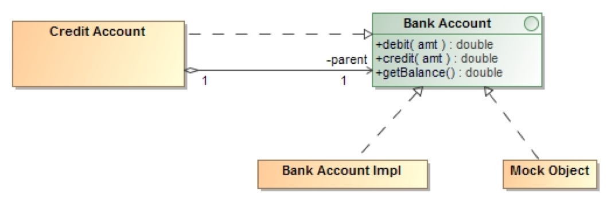

# Testing Doubles Concepts

## Our code interacts with other things

- Network resource – database, web service, etc.
- Code being developed in parallel by another person/team
- Container (e.g. objects with lifecycle methods)

### What if the collaborator

- ...does not exist yet
- ...is not available for use in tests
  
**One possibility:** run it in its real environment

- Integration testing
- Important to test interactions between your class and the rest
  
**But:** you need to test the logic of your class in isolation

>Roy Osherove: “An external dependency is an object in your system that your code under test interacts with, and over which you have no control.  (Common examples are filesystems, threads, memory, time, and so on.)”  The Art of Unit Testing, p. 50.  

Objects with which the class under test interacts are also known as its collaborators, and substitutes for them used in testing are sometimes referred to as test doubles.  Osherove uses the term fake to cover both stubs and mocks.  

---

## What is Mocking

It is a way to test your code functionality in isolation

Does not require:

- Database connections
- File server reads
- Web services

The mock object itself does the ‘mocking’ of the real service, returning dummy data

The mock object is just simulating the behaviour of a real method, external component

---

## Stubs

### Stub: controllable replacement for existing dependency

>"Provide canned answers to calls made during the test, usually not responding at all to anything outside what's programmed in for the test ... may also record information about calls" – Fowler

A class which is (ideally) the simplest possible implementation of the logic in the real code

**Good for:** coarse-grained testing - replacing a complete external system, e.g. web server, database

**But:**

- Often complex to write
- Introduce their own debugging & maintenance issues
- Not so suitable to fine-grained unit testing

The quote from Martin Fowler's comes from his article "Mocks Aren't Stubs", which can be found at
[http://martinfowler.com/articles/mocksArentStubs.html]

>Imagine you want to test the logic of something like a Servlet in isolation, i.e. without placing it in a container and firing browser requests at it.  A Servlet is passed instances of the interfaces HttpServletRequest and HttpServletResponse when its service method is invoked.  On the stubbing approach, you would create your HttpServletRequestStub class, and this would involve implementing the 30 methods in the HttpServletRequest interface and the 36 from its super-type, the ServletRequest interface.  (See [http://docs.oracle.com/javaee/6/api/javax/servlet/http/HttpServletRequest.html])

---

## Mocks

Mock objects (mocks)

>Mock: "an object created to stand in for an object that your code will be collaborating with.  Your code can call methods on the mock object, which will deliver results as set up by your tests" – Massol, p. 141

To mock a database ResultSet:

- You are not creating an object with state (records with mock data sets)
- You are creating an object which will respond to (method calls from) your code as if it had a certain state

Several Dynamic Mock Frameworks in Java:

- EasyMock
- JMock
- Mockito
- Powermock
- JMockit and more

Mocks and stubs are not necessarily mutually exclusive; it may be appropriate, depending on the class being tested, to combine use of mocks and stubs.

Mocks and stubs can be handwritten, simple classes – if they remain simple they will have the advantage of simplicity and readability over frameworks.  A dynamic fake object is a mock or stub created at runtime – using a framework, rather than handwritten.  jMock and EasyMock are two leading Java mock objects frameworks, but there are others.  See [http://mockobjects.com]; also listed are [mockito](http://mockito.org), [rMock](http://rmock.sf.net), and [SevenMock](http://seven-mock.sf.net).

Some argue that "Isolation framework" is a better term than "Mocking framework", because it more clearly signals the intent: isolating the unit tests from their external dependencies.

---

## Stubs vs. Mocks

Stubs enable tests by replacing external dependencies  
Asserts are against the Class Under Test, not the stub  

Test     <————>    CUT   <————>     Stub  
         asserts        interacts

**Mocks:** can be used for stubbing (as above)

**Or:** test can ask a mock to verify that the CUT interacts with the external dependency in the correct way  
Asserts are verifies against the mock  

CUT    <————>     Mock    <————>    Test  
      interacts           asserts

### Mock object

>“a fake object … that decides whether the unit test has passed or failed.  It does so by verifying whether the object under test interacted as expected with the fake object.  There’s usually no more than one mock per test.”  (Osherove, p. 84)

Using a mock is much like using a stub, except that the mock will record the interactions, which can be verified.  Tests should test a single thing, so there should be at most one mock per test – all other fakes should be stubs.  Having multiple mocks means you’re not just testing a single thing.

---

## When to use mock objects

>When the real object:
>
> - Has non-deterministic behaviour
> - Is difficult to set up
> - Has behaviour that is hard to cause (such as network error)
> - Is slow
> - Has (or is) a UI
> - Uses a callback (tests need to query the object, but the queries are not available in the real object (for example, “was this callback called?”)
> - Does not yet exist  
>From: Mackinnon, Freeman and Craig “Endo-testing: Unit Testing with Mock Objects”

---

## A useful consequence of mocking

### Don’t Stub, Mock  

- Think how many times you’ve had to write stub code just get something compiled or to debug and walk through a piece of code

### Mock it, don’t stub it…

- You may not have access to some because it is being written by another team, but you do have a set of agreed interfaces
Mock those interfaces, set the desired expectations
- Debug your code



---

## Drawbacks of mock objects

### Do not test interactions with container or between the components

- Do not give full confidence that code will run in target container
- i.e. still need integration tests

### Tests coupled very tightly to implementation

- Expectation-setting makes tests mirror internal implementation

### Do not test deployment part of components

### Most frameworks cannot mock static methods, final classes and methods

- Static methods can be mocked with workaround
- Enabled by: Powermock (extends easymock & mockito)

(The first three points here are adapted from Massol, JUnit In Action, p. 171.)

---

## Dependency Injection

Dependency is all about injecting dependencies, setting relations between instances

It helps to remove tight coupling

We use interfaces instead of using concrete classes to illustrate a dependency

```java
public interface IEngine { }
public class FastEngine implements IEngine { }  tight coupling
```

We ‘inject’ the interface into the class:

```java
public class FastEngine {
    private IEngine engine;
    public FastEngine(IEngine engine) { this.engine = engine; }
}
```

## Dependency Injection - Example

- Without Injection

```java
public void print() {
   Owner owner = new Owner();
   owner.setName(“Owner1”);
   owner.setId(98765);
   System.out.println(“Owner “ + owner.getId() + ” is “ + owner.getName());
}
```

- Using Injection

```java
public void print(Owner owner) {
   System.out.println(“Owner “ + owner.getId() + ” is “ + owner.getName());
}
```

## Dependency Injection Methodology

Rather than creating concrete instances, inject them at runtime

Two ways to perform Dependency Injection:

- By Constructor
- By Setter method

Need a way to manage (or wire) the dependencies

- In Java, the Spring framework provides ways to do this – it supports DI out of the box using annotations

### Constructor

```java
public class Owner {
    Pet pet;

    public Owner(Pet pet) {
        this.pet = pet;
    }
}
```

- The value of the Pet is set by calling a constructor method

### Setter method

```java
public class Owner {
    Pet pet;

    public void setPet(Pet pet) {
        this.pet = pet;
    }
}
```

- The value of the Pet is set by calling a setter method

## Dependency Injection Containers

We can use a dependency injection container which can inject the mock objects into your unit tests during unit testing

Some DI containers include:

- Spring DI
- Butterfly DI Container
- Dagger
- Guice
- PicoContainer

Many unit tests don’t require a DI container if their dependencies are simple to mock out

## Dependency Injection Summary

- Always use interfaces instead of using concrete classes to illustrate a dependency
- Avoid to implicitly set the concrete implementation of a dependency in the class itself
- A dependency can be set through constructor or setter based injection
- Dependency injection makes unit testing very flexible
- Use of DI container for complex dependencies

We inject the dependency through a constructor or a setter.

References come from: [https://javaranch.com/journal/200709/dependency-injection-unit-testing.html]
