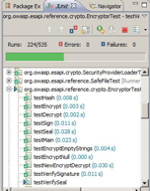
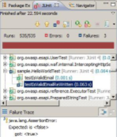
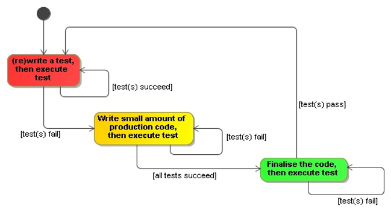

# Testing Driven Development Concepts

## Traditional Development

### Code – Test – Refactor

- Tests as an afterthought
  - “If there’s time”/leave to testers

- Problem: high level of defects
  - Lengthy testing phase after a release is frozen
  - Cost of fixing bug discovered then far higher than if bug caught when introduced into code

- Problem: poor maintainability
  - Legacy spaghetti code that ‘works’
  - Can't be touched – fearing of breaking

---

## Test Driven Development Steps

1. Write a failing test
2. Write just enough code to pass the test
3. Pass the test
4. Refactor

## The Three Rules of TDD

>You are not allowed to write any production code unless it is to make a failing unit test pass.
>
>You are not allowed to write any more of a unit test than is sufficient to fail; and compilation failures are failures.
>
>You are not allowed to write any more production code than is sufficient to pass the one failing unit test.
>
>[Uncle Bob](http://butunclebob.com/ArticleS.UncleBob.TheThreeRulesOfTdd)

---

## What is TDD

- Core practice of XP
- Can be adopted within other methodologies
  - "Test-first programming is the least controversial and most widely adopted part of Extreme Programming (XP). By now the majority of professional Java™ programmers have probably caught the testing bug" – Elliotte Rusty Harold
- Test written before implementation
  - Tools and techniques make TDD very rigorous process
- aka Test Driven Design
  - Tests drive design of API
- Developers become "Test infected" (Erich Gamma)
  - Cannot program without test first

### Test – Code – Refactor

Kent Beck's summary of TDD:

1. Write new code only if you first have a failing automated test
2. Eliminate duplication

Red - Green - Refactor

The image above illustrates that the famous green bar is indeed a progress bar. The image below shows the final outcome of running this series of tests: there are 3 failures.

### The Red - Green - Refactor Workflow

### The TDD process

- First write the test
  - Designing the API for the code to be implemented
  - Using an API (in tests) is best way to evaluate its design

- Write just enough code for test to pass
  - Minimises code bloat
  - Keeps developer focussed on satisfying the requirement embodied in the test

- Refactor: change some code w/o changing functionality

>“A disciplined technique for restructuring an existing body of code, altering its internal structure without changing its external behaviour" – *Fowler*

- Develop in small iterations: “test a little – code a little”

---

## TDD Strategies (Beck)

Fake it:

- Return a constant; gradually replace constants with variables

Obvious implementation:

- If a quick, clean solution is obvious, type it in

Triangulation:

- Locating a transmitter by taking bearings from 2 or more receiving stations
- Only generalise code when you have 2 or more different tests

The point is to get developers to work in very small steps, continually re-running the tests.

                       <=> A
                      /  \
                     /    \
                    /      \
                   /        \
                  /          \
                 /            \
                ¶              []
                B               C

Triangulation: someone on the boat at A can determine their position on a chart by taking compass bearings to the lighthouse at B and the tower at C.  Or conversely, observers at B and C can work out the location of the boat by taking bearings to it from their known points on the shore and sharing their readings.  In fact, sailors are taught to take a three-point fix, with charted landmarks that are as widely separated as possible, for better accuracy.  

---

## Testing Heuristics

Test List:

- Start by writing a list of all tests you know you have to write
  
Starter Test:

- Start with case where output should be same as input
  
One Step Test:

- Start with test that will teach you something and you are confident you can implement
  
Explanation Test:

- Ask for and give explanations in terms of tests

Learning Tests:

- Check your understanding of a new API by writing tests

These mainly come from Kent Beck's book **Test Driven Development**, Chapter 26 – "Red Bar Patterns".  They're primarily suggestions for breaking down a seemingly mountainous task of developing some new functionality in a test-driven way, into very small, tractable steps.

For example:
> "a poster on the Extreme Programming newsgroup asked about how to write a polygon reducer test-first. The input is a mesh of polygons and the output is a mesh of polygons that describes precisely the same surface, but with the fewest possible polygons. “How can I test-drive this problem since getting a test to work requires reading Ph.D. theses?”

Starter Test provides an answer:
The output should be the same as the input. Some configurations of polygons are already normalized, incapable of further reduction.
The input should be as small as possible, like a single polygon, or even an empty list of polygons."

Explanation Test is primarily for communicating within the development group, clarifying the requirements for some item of functionality by expressing them precisely in terms of tests.  

---

## TDD Benefits

- Build up library of small tests that protect against regression bugs
- Extensive code coverage
  - No code without a test
  - No code that is not required
- Almost completely eliminates debugging
  - More than offsets time spent developing tests
- Tests as developer documentation
- Confidence not fear
  - Confidence in quality of the code; confidence to refactor

A regression bug is a defect which stops some bit of functionality working, after an event such as a code release, or refactoring.  
